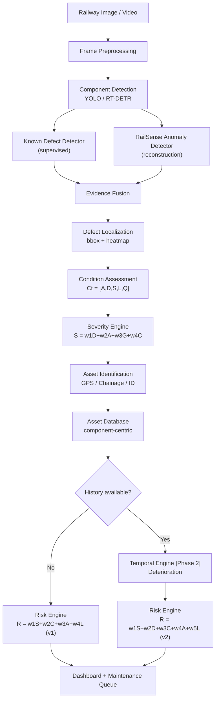
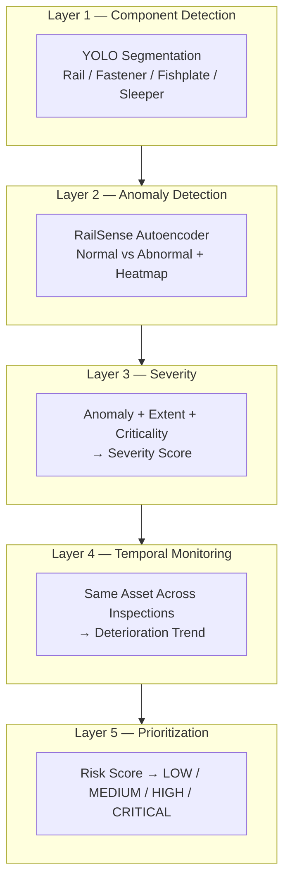
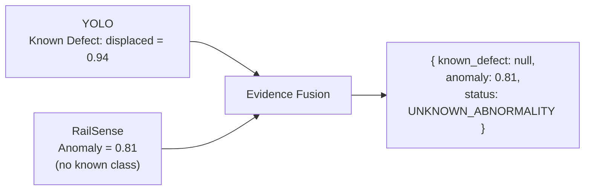

# RailSafe — Temporal Vision-Based Railway Infrastructure Condition Monitoring and Risk-Based Maintenance Prioritization

> **One-line pitch:** RailSafe converts raw railway inspection images/video into persistent component-level condition histories and explainable maintenance priorities — YOLO finds the component, RailSense checks if it looks normal, and the risk engine tells you what to inspect first.

---

## 1. What RailSafe Is

RailSafe is a **computer-vision-based railway inspection and maintenance decision-support platform**. It:

1. Detects railway components in full-scene images (rail, fastener, sleeper, fishplate)
2. Runs **hybrid inspection**: supervised known-defect detector + normality-based anomaly detector
3. Localizes abnormalities (bounding box + anomaly heatmap)
4. Estimates **condition and severity** per component
5. Associates observations to a **persistent asset record** (GPS / chainage / track)
6. **[Phase 2]** Tracks the same component across repeated inspections to estimate **deterioration**
7. Produces an **explainable risk score** and ranked maintenance queue

### The Pipeline in One Diagram



### Five-Layer View (Viva Explanation)



---

## 2. Why Hybrid Detection

YOLO answers *"what and where"*. It struggles with unseen defect types. RailSense answers *"does this look like normal training data"* via reconstruction error, catching abnormalities outside the fixed class list.



This is **Contribution A**.

---

## 3. What Makes RailSafe Different (Contributions)

| Contribution | Idea | Output |
|---|---|---|
| **A — Hybrid inspection** | Known detector + normality detector | Detects both predefined and novel abnormalities |
| **B — Component-centric** | `Asset → Inspection 1..N` not `Image → Defect` | Persistent history per physical component |
| **C — Explainable risk** | Decomposed `R` with contributors | `why` behind every score |
| **D — Longitudinal extension** | `C(t1)..C(tn) → deterioration` when repeated data exists | Temporal risk improvement |

Research identity:

> *Does converting image-level defect evidence into persistent component-level condition information improve maintenance prioritization? And does incorporating condition trajectory improve it further?*

---

## 4. Repository Structure

```text
RailSafe/
├── datasets/{railsense,track_surface_faults,rfdd,temporal}
├── ml/
│   ├── component_detection/   # YOLO / RT-DETR
│   ├── defect_detection/      # RFDD, Surface Faults heads
│   ├── anomaly_detection/{railsense,patchcore,padim}
│   ├── severity/              # severity_engine.py
│   ├── temporal/              # association, deterioration
│   └── risk/                  # risk_engine.py
├── backend/{api,models,schemas,services,database}  # FastAPI + PostgreSQL/PostGIS
├── frontend/                  # React + Vite + Tailwind + Leaflet + Recharts
├── experiments/{baselines,ablations,temporal,results}
├── notebooks/
└── docs/
    ├── architecture/
    ├── literature/
    ├── datasets/
    └── research/
```

See [docs/architecture/overview.md](docs/architecture/overview.md) and [docs/research/phases.md](docs/research/phases.md).

---

## 5. Datasets — Honest Strategy

| Dataset | Size | Use | Field/Proxy | Longitudinal? |
|---|---|---|---|---|
| **RailSense Railway Component** | crossties/fasteners/fishplates/tracks normal+damaged | Primary anomaly learning | **Controlled proxy** (per metadata) | No |
| **Railway Track Surface Faults** | 5,153 images, 7 fault classes, inspection vehicle | Rail surface detection | Field (vehicle-mounted) | No (frames, no asset IDs) |
| **RFDD** | 1,350 images 2048×2021, 8,100+ instances, 6 classes | Fastener detection/segmentation | Field full-scene, pixel masks | No |
| **Rail-5k** | ~5,000 images, 1,100 annotated, 13 types | External validation if access granted | Field (HSR/subway China) | No |
| **Rail-DB** | 7,432 pairs, 9 scenes, rail polylines | Rail geometry/localization (optional) | Field | No |
| **Georeferenced Subgrade** | 661 records, 8 categories, GPS | Contextual risk layer (not CV) | Geospatial | No |
| **Custom longitudinal** | `AssetID + timestamp + image + location + condition` | **Required for RQ5/deterioration** | Must collect (Phase 10) | **Yes — the gated piece** |

> **Do not fake temporal:** never pair unrelated images as `t1/t2`, never synthesize cracks, never infer deterioration from anomaly differences across different assets.

Full inventory: [docs/datasets/datasets.md](docs/datasets/datasets.md)

---

## 6. What We Claim at Each Stage

| Stage | Claim | Requires |
|---|---|---|
| **RailSafe v1** | Automated component+defect inspection, normality anomaly detection, localization, condition/severity, explainable priority | Current public datasets |
| **RailSafe v2** | Longitudinal condition monitoring & deterioration-informed ranking | Custom repeated-inspection dataset |
| **RailSafe v3** | Predictive failure forecasting | Outcome data (inspection→maintenance→failure) — out of scope |

Do not call v1 "predictive maintenance" for generating a risk score.

---

## 7. Quick Start

### Train on Kaggle / Colab (1-click, recommended)

```bash
# Kaggle: New Notebook → Add Data → GitHub → YOUR/RAILSAFE → then:
!python scripts/setup_kaggle.py --datasets railsense surface_faults
!python scripts/train.py --task yolo --epochs 10 --model yolo11n.pt

# Colab:
!git clone https://github.com/YOUR/RAILSAFE.git && cd RAILSAFE
!python scripts/setup_kaggle.py && python scripts/train.py --task yolo --epochs 10
```
See [`docs/training/README.md`](docs/training/README.md) + [`notebooks/Train_on_Kaggle_Colab.ipynb`](notebooks/Train_on_Kaggle_Colab.ipynb).

### Local Quick Start

```bash
# Phase 0 — audit datasets before any training
# see docs/datasets/datasets.md
bash datasets/download_railsense.sh        # 858 imgs via Kaggle API
bash datasets/download_surface_faults.sh  # 5153 imgs (Mendeley mirror on Kaggle)
python ml/dataset_tools/convert_to_manifest.py  # -> datasets/manifest.jsonl (6011 records, grouped, no leakage)
python ml/dataset_tools/prepare_yolo.py         # -> datasets/yolo_surface + surface_data.yaml

# Phase 1 — reproduce RailSense baseline (no modifications)
# needs TF 2.16 in separate venv (see docs/training/README.md)
python scripts/train.py --task railsense --epochs 5

# Phase 3 — component detector (YOLO classify on surface_faults; RFDD 8.24GB gated)
python scripts/train.py --task yolo --epochs 10 --model yolo11n.pt  # 2.6M fast, or yolo11m.pt 20.1M best
# ml/component_detection/train.py — YOLO on RFDD full-scene (when RFDD present)

# Phase 4 — integrated pipeline
# Full frame -> detector -> crop -> railsense.predict(crop) -> fusion

# Backend / Frontend
# backend: FastAPI + SQLAlchemy + PostgreSQL/PostGIS
# frontend: React + Vite + Tailwind + Leaflet
```

---

## 8. Documentation Map

| Doc | Purpose |
|---|---|
| [docs/architecture/overview.md](docs/architecture/overview.md) | Full system diagram + data flow |
| [docs/datasets/datasets.md](docs/datasets/datasets.md) | Dataset inventory (all 7 sources) |
| [docs/datasets/taxonomy.md](docs/datasets/taxonomy.md) | Defect taxonomy constrained to data |
| [docs/datasets/schema.md](docs/datasets/schema.md) | Unified data schema |
| [docs/datasets/data-license.md](docs/datasets/data-license.md) | Licenses & redistribution |
| [docs/architecture/anomaly.md](docs/architecture/anomaly.md) | RailSense engine detail |
| [docs/architecture/severity.md](docs/architecture/severity.md) | Condition & severity |
| [docs/architecture/temporal.md](docs/architecture/temporal.md) | Association + deterioration |
| [docs/architecture/risk.md](docs/architecture/risk.md) | Risk + explainability |
| [docs/research/experiments.md](docs/research/experiments.md) | 9 experiments + ablation |
| [docs/research/evaluation.md](docs/research/evaluation.md) | Metrics table |
| [docs/research/research-questions.md](docs/research/research-questions.md) | RQs & hypotheses |
| [docs/research/phases.md](docs/research/phases.md) | 14 development phases |
| [docs/research/claims.md](docs/research/claims.md) | v1/v2/v3 claim boundaries |
| [docs/literature/matrix.md](docs/literature/matrix.md) | Literature matrix |

---

## 9. Sources

- RailSense — https://github.com/kashtennyson/RailSense
- Railway Track Surface Faults — https://data.mendeley.com/datasets/8hxtgyyxrw/2
- RFDD — https://github.com/NIM-NMDC/RFDD + https://doi.org/10.57760/sciencedb.msdc.00071
- Rail-5k — https://zenodo.org/records/4872619
- Rail-DB — https://github.com/Sampson-Lee/Rail-Detection
- Subgrade — https://www.nature.com/articles/s41597-024-03112-7
- Reviews — MDPI Sensors 2026 (906), ScienceDirect systematic review (2046043024000716)

---

## 10. Status (Locked 2026-09-15)

**Current:** Phase 0 audit verified via live web fetch (see [docs/REQUIREMENTS_LOCK.md](docs/REQUIREMENTS_LOCK.md)). All dataset sizes/licenses/DOIs locked. **LOCKED versions:** RailSense MIT (51 commits, ResNet50 `conv4_block6_out`, 256×256×3, `α·(1-SSIM)+(1-α)L1`), Surface Faults Mendeley `10.17632/8hxtgyyxrw.2` v2 CC BY 4.0 120 FPS EKEN-H9R, RFDD `10.57760/sciencedb.msdc.00071` 1350/2048×2021 1050-200-100 MIT, Rail-5k **restricted BY-NC-ND 4.0 email gate** `10.5281/zenodo.4872619`, Rail-DB MIT 7432 pairs, Subgrade figshare `10.6084/m9.figshare.24086016` 661 records. No temporal claims until longitudinal data collected (GATED). Architecture supports temporal; experiments gated.

## 11. Requirements Lock

See **[docs/REQUIREMENTS_LOCK.md](docs/REQUIREMENTS_LOCK.md)** for full locked specification + 8 open decisions requiring user input before FINAL LOCK.
