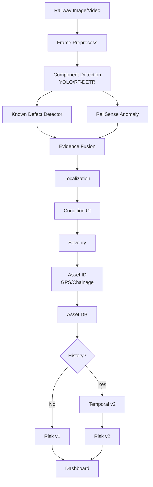

# RailSafe — Master Project Specification (Condensed)

> This is the **execution specification** derived from the full master reference. For narrative explanation see `../README.md`; for gated claims see `research/claims.md`.

## 1. Problem

Railway inspection generates thousands of frames. Single-image defect detection is insufficient for maintenance decisions which need: *which asset, where, how severe, is it worsening, what to inspect first?*

Separation:

```text
Detection → Localization → Condition → Asset ID → Historical Monitoring → Risk → Prioritization
```

## 2. Objectives

- **Primary:** Component-centric visual inspection combining supervised defect detection + normality anomaly detection with condition assessment and explainable prioritization.
- **Secondary (gated):** Whether repeated observations of the same asset improve prioritization vs single-inspection. Only claimed after Dataset G.

## 3. Contributions (A-D)

A. Hybrid inspection (known + anomaly) — broader abnormality coverage.
B. Component-centric representation (`Asset → Inspections`).
C. Explainable risk (`R` decomposed).
D. Longitudinal extension when repeated data exists.

## 4. Scope

Start with `fasteners, rail, sleepers/crossties, fishplates/joints` — aligned with available datasets and literature concentration on track/rail/fastening.

## 5. Architecture (Full)



## 6. Data Roles

- **RailSense** → anomaly (proxy, normal-train).
- **Surface Faults (5,153)** → rail surface.
- **RFDD (1,350 / 8,100+ / 6 classes / masks)** → fastener primary.
- **Rail-5k** → external val if accessible.
- **Rail-DB (7,432)** → rail geometry optional.
- **Subgrade (661 records)** → contextual risk only.
- **Custom longitudinal** → gated, `asset_id + timestamp + image + location + condition`.

## 7. Key Formulas

- Anomaly: `A = D(I, Î)` higher = more abnormal.
- Condition: `Ct = [At, Dt, St, Lt, Qt]`.
- Severity: `S = w1D + w2A + w3G + w4C` (prototype weights).
- Association: `Aij = wgGij + wvVij + wsSij`.
- Deterioration: `D_t = f(C_{t-k}..C_t)`, baseline `C(t)=β0+β1·t`.
- Risk: `R = w1S + w2D + w3C + w4A + w5L`, `R∈[0,100]`, `LOW 0-25 / MEDIUM 25-50 / HIGH 50-75 / CRITICAL 75-100` (support thresholds).

## 8. Evaluation

See `research/evaluation.md` for per-module metrics + `Precision@K/Recall@K/NDCG@K` for ranking. Leakage: group by `sequence_id/asset_id`; cross-dataset `train A test B`.

## 9. Baselines & Ablation

B0 image-cls → B1 YOLO → B2 RailSense → B3 PaDiM → B4 PatchCore → B5 YOLO+RailSense → B6 +severity → B7 RailSafe → B8 current-only → B9 current+history.
Ablation: `A detection → B +anomaly → C +severity → D +temporal → E +criticality`.

## 10. Phases

0 Audit → 1 Reproduce RailSense → 2 Normalize → 3 Detector → 4 Integration → 5 Defect heads → 6 Fusion → 7 Severity → 8 Registry → 9 Risk (v1) → 10 Collection → 11 Association → 12 Deterioration → 13 Temporal Risk → 14 Dashboard.

Start simple: linear/EMA before LSTM.
