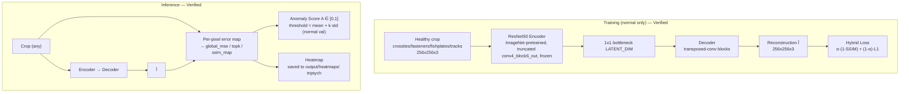
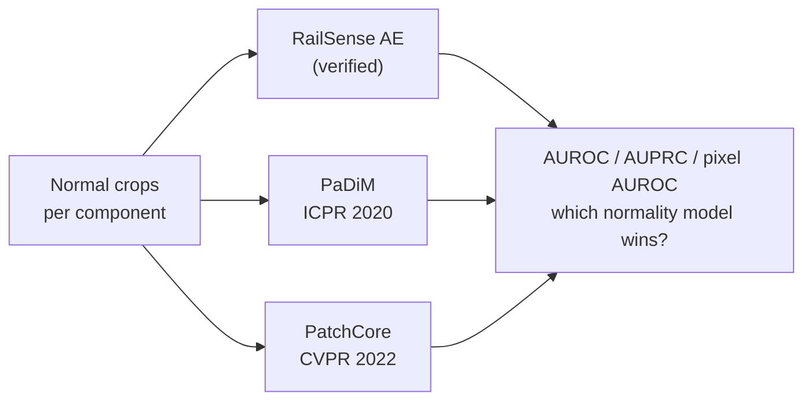
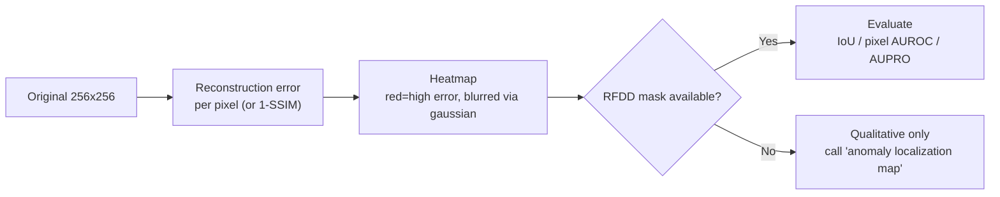

# Anomaly Detection — Layer 2 (RailSense Engine) (Verified 2026-09-15, Locked)

## 1. Core Idea (Locked)

Train on **normal** components only. At inference, poor reconstruction → high anomaly. Verified against RailSense main branch (not legacy classifier).



## 2. RailSense Baseline (Lock — Do Not Modify Before Repro)

Verified from live GH fetch (51 commits, MIT):

- **Encoder:** **ResNet50 (ImageNet, `conv4_block6_out`, frozen)**, BatchNorm frozen even during finetune.
- **Decoder:** symmetric transposed-conv upsampling to 256×256×3.
- **Loss:** **Hybrid structural loss** `α·(1-SSIM) + (1-α)·L1` (prioritizes structure over raw pixels).
- **Training stages:** **Stage 1** decoder-only (encoder frozen); **Stage 2** `--finetune` resumes best checkpoint, unfreezes **top blocks from `conv4_block4`** at `--finetune_lr 1e-5` (BatchNorm stays frozen).
- **Data:** `data/<component>/{normal,damaged}/` with Albumentations (flips, brightness/contrast, motion blur, shadow, noise, perspective); **only normal for train/val**, test = leftover normal + all damaged (seeded).
- **Scoring (src/scoring.py):** `global_mse` (mean over image) / `topk` (mean of worst pixels, avoids background averaging) / `ssim_map` (top-k of 1-SSIM map).
- **Evaluation (src/evaluate.py):** Threshold `mean + THRESHOLD_K·std` on validation normal scores; metrics **ROC-AUC, Average Precision (prevalence floor + AP-lift), recall@precision≥0.90, precision, recall** + latency/throughput + triptychs `output/heatmaps/` + `best_model_metadata.json`.
- **Config/Tracking:** `src/config.py` centralized, W&B via `src/logger.py --wandb` logs config, dataset stats, triptychs, histograms, ROC/PR, artifact.
- **CLI (main.py):** `train / evaluate / predict / both` — `python main.py both --wandb` is the repro command. Requirements: `requirements.txt` (CUDA/CPU) / `requirements-silicon.txt` (Apple Silicon).

> **First action:** `python main.py both` with frozen config — this is Exp 1.

## 3. Alternatives (Exp 2 — Locked Comparison)



Verified via anomalib + MVTec:

- **PaDiM (Defard et al., ICPR 2020, arXiv:2011.08785):** pretrained CNN patch embedding + multivariate Gaussian per patch; exploits correlations across CNN semantic levels; SOTA on MVTec AD/STC. MVTec image AUROC ~0.945 (anomalib Table 1), pixel ~0.968 (Table 2).
- **PatchCore (Roth et al., CVPR 2022):** memory bank + coreset subsampling + nearest-neighbor; anomaly = max distance to nearest normal patch; Image AUROC ~0.979-0.99, pixel ~0.980 on MVTec. **Outperforms PaDiM** on most MVTec categories per supplement.
- **Library:** Use **anomalib** (`anomalib.data.Mvtec`) for both — do not reimplement from scratch for v1.

Component-specific vs generic: separate `model_fastener`, `model_rail`, etc. — **H2 expects component-specific > generic**.

## 4. Inference Interface (Locked)

```python
# ml/anomaly_detection/railsense/inference.py (locked contract)
result = anomaly_model.predict(component_crop)  # crop from component detector, resized 256x256x3
# -> {
#   "anomaly_score": 0.78,          # float [0,1], normalized via anomalib [0,1]
#   "status": "ANOMALY" | "NORMAL" | "UNKNOWN_ABNORMALITY",
#   "heatmap": "output/heatmaps/xxx.png",  # numpy array or path to triptych
#   "method": "ssim_map" | "topk" | "global_mse",
#   "threshold": 0.52,              # validation-derived mean + k*std
#   "confidence": 0.82              # derived from distance to threshold
# }
# Score: A = D(I, Î) via selected method; threshold on validation, not hardcoded 0.5
```

Calibration: threshold selection on **validation normal scores only** — report PR curve, not fixed threshold.

## 5. Heatmap Semantics (Locked)



Do not claim exact defect segmentation without validation vs RFDD masks.

## 6. Locked Input / Output Contract

- **Input:** `component_crop` from detector, normalized to 256×256×3, ImageNet normalization.
- **Output:** `anomaly_score ∈ [0,1]` (anomalib-normalized), `status`, `heatmap_path`, `method`, `threshold`.
- **Failure:** if crop < 32px or detector confidence < 0.3 → return `{"anomaly_score": null, "status": "SKIPPED", "reason": "low_confidence"}`.

## 7. Why This Verifies

Live fetch confirms RailSense is **not** the legacy InceptionV3 classifier (858 imgs / 7 classes / RailwayTrackCrackDetection repo) — main branch is the autoencoder described above with 51 commits; legacy is on `legacy-version` branch only.
