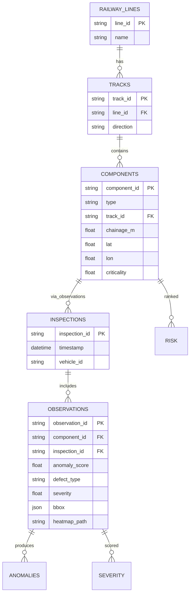
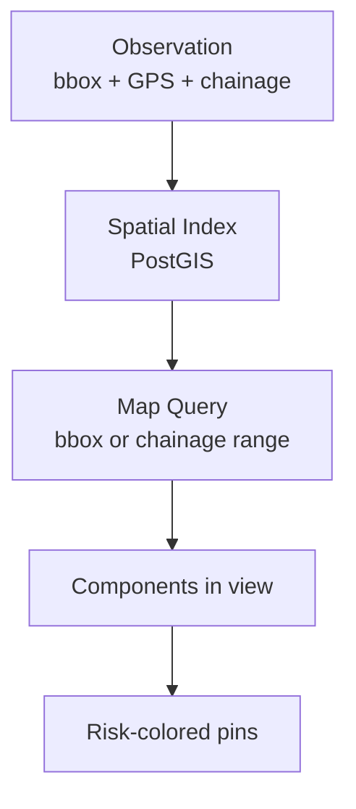
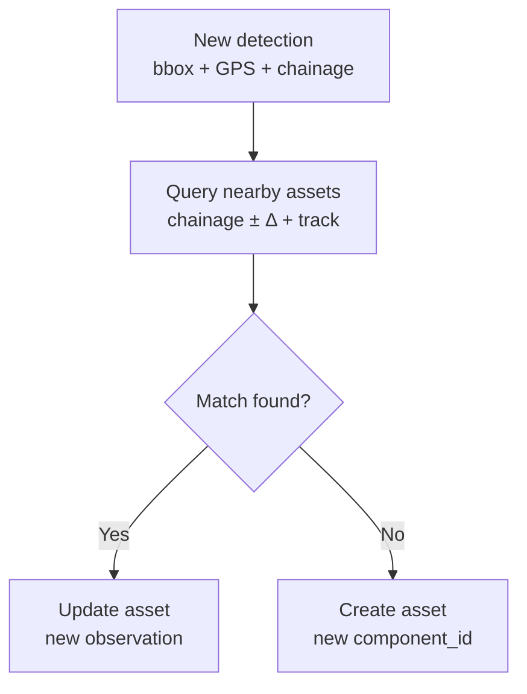

# Asset Registry & Spatial Representation

## 1. Central Entity: `component_id`

```text
FASTENER-001821
RAIL-004102
SLEEPER-000913
FISHPLATE-000442
```

All observations attach to this ID. Image-level results are ephemeral; asset-level records are persistent.

## 2. Schema



## 3. Spatial Representation

GPS alone is insufficient for railway asset management. Use triple:

```json
{
  "line": "LINE-01",
  "track": "UP",
  "chainage_m": 124320,
  "latitude": 12.123456,
  "longitude": 77.123456
}
```

- `chainage` = linear distance along track (authoritative for ordering).
- `GPS` = geographic position for mapping.
- `track` + `line` = disambiguation.

Database: **PostgreSQL + PostGIS** for spatial indexing and `chainage` range queries.



## 4. Asset Identification at Ingest



Phase 1 (v1): simple spatial assignment (chainage window). Phase 2: full temporal association (see `temporal.md`).

## 5. API Sketch

```text
GET  /assets?line=LINE-01&chainage_from=124000&chainage_to=125000
GET  /assets/{component_id}
GET  /assets/{component_id}/history
POST /inspections  (upload frames + GPS/chainage)
```

See `backend/` scaffold.
