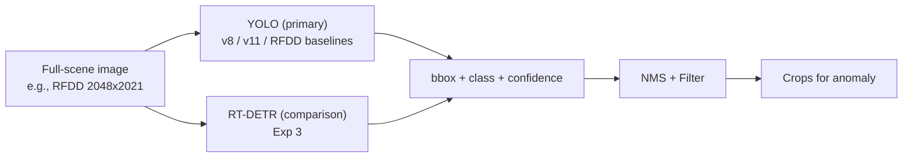

# Component Detection — Layer 1

## 1. Purpose

Localize railway components in full-scene inspection frames before any crop-level analysis. Without this, RailSense (trained on crops) cannot be applied to real frames.

## 2. Classes (v1)

```text
rail
fastener
sleeper / crosstie
fishplate / rail joint
```

Optional supervised heads (dataset-dependent):

```text
defective_fastener
defective_fishplate
```

Constrained by actual annotated data — see `../datasets/taxonomy.md`.

## 3. Model Choice



- **Primary:** Ultralytics YOLO (v8/v11). RFDD provides baseline configs for multiple generations.
- **Comparison:** RT-DETR for Exp 3.
- **Input:** Full-scene frames from RFDD / Surface Faults.
- **Output:** `[{component_type, bbox, confidence}]`

## 4. Training

- Data: RFDD full-scene + Surface Faults (per-dataset heads; no forced universal taxonomy).
- Augmentations: standard YOLO (mosaic, HSV, rotation) + railway-specific (brightness for lighting variance).
- Splits: **grouped by video/sequence** (never random frame split).
- Metrics: `mAP@50, mAP@50:95, Precision, Recall, F1`.

## 5. Inference Interface

```python
# ml/component_detection/inference.py
detections = detector.predict(frame)
# -> [{"component_type": "fastener", "bbox": [x,y,w,h], "confidence": 0.97}, ...]

crops = [crop_frame(frame, d["bbox"]) for d in detections]
```

## 6. Evaluation (Exp 3)

Compare YOLO vs RT-DETR on same grouped splits. Also cross-dataset: `train RFDD → test Surface Faults` to measure domain shift (H4).

## 7. Failure Modes

- Motion blur / low light → lower recall; evaluate robustness split.
- Small fasteners at distance → need multi-scale training.
- Fishplate occlusion by ballast → augment with occlusion.
