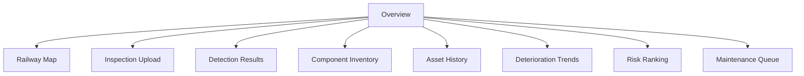
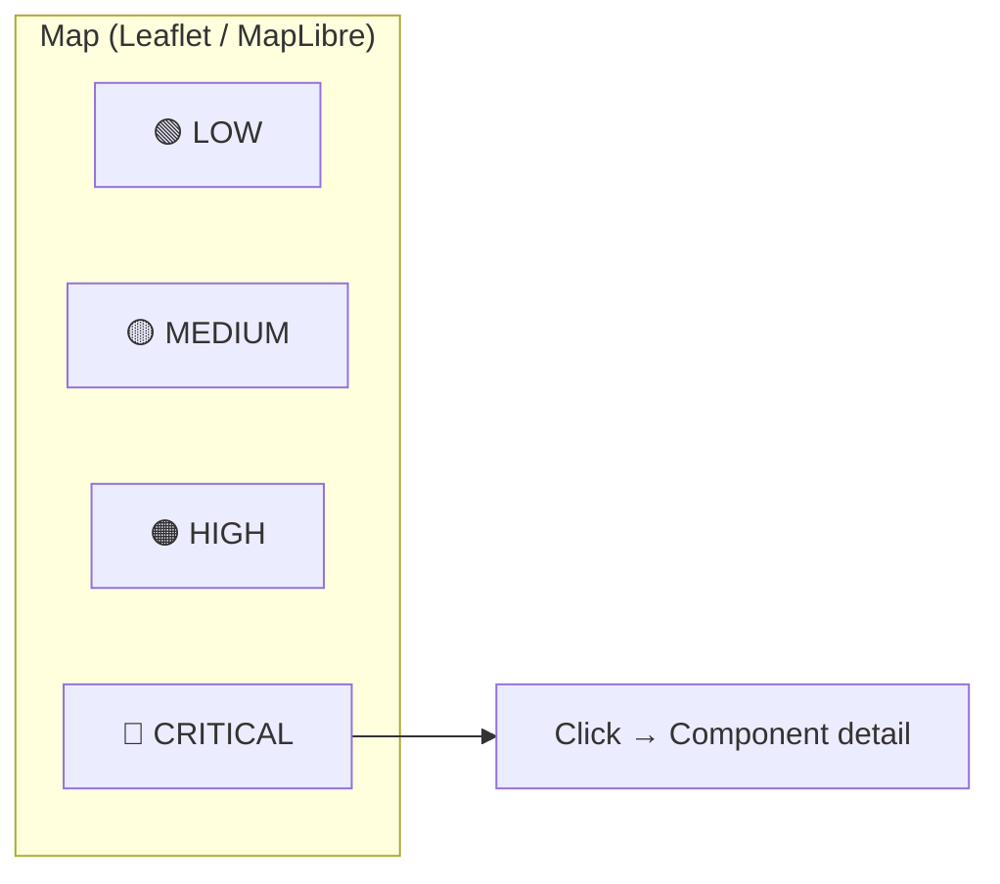

# Dashboard

> The dashboard is the most visible deliverable. It should make the component-centric and temporal ideas immediately obvious.

## 1. Pages



## 2. Overview

```text
╔════════════════════════════════╗
║  RAILSAFE                      ║
║  Railway Infrastructure Health ║
╠════════════════════════════════╣
║  Inspected      12,450         ║
║  Normal         11,930         ║
║  Suspicious        382         ║
║  High Risk         104         ║
║  Critical           34         ║
║                                ║
║  Deteriorating      18         ║
╚════════════════════════════════╝
```

KPIs: `Total Assets, Detected Anomalies, High Risk, Critical, New Defects, Deteriorating Assets`.

## 3. Railway Map



Click marker:

```text
FST-1821 | KM 124+320 | Risk 86 | Anomaly 0.82 | Trend RAPID ↑
```

Features: filter by `risk level / component type / line+chainage range`, cluster pins at low zoom.

## 4. Asset Detail

```text
FASTENER-1821

Current condition  ████████░░ 78%
Severity           HIGH
Risk               86 / 100

History:
Jan  ███      0.51
Mar  ████     0.62
Jun  ██████   0.74
Sep  ████████ 0.86

Deterioration: +0.18 / inspection  (β1)

Latest image  [image]
Heatmap       [heatmap overlay]

Recommendation: Urgent inspection
Contributors: severity 28, anomaly 19, deterioration 22, criticality 12, area 5
```

## 5. Maintenance Queue

Sorted by `R` descending.

```text
Priority 1  FST-381  12.43 km  CRITICAL  91
Priority 2  FST-194  14.21 km  CRITICAL  88
Priority 3  RAIL-882 18.77 km  HIGH      76
...
```

Export: CSV / PDF for field teams.

## 6. Inspection Upload

- Drag-drop images / video
- Shows preprocessing → detection → anomaly → severity progress
- Writes to `/inspections` and updates assets

## 7. Stack

- **React + Vite + Tailwind** for UI
- **Leaflet / MapLibre** for map
- **Recharts** for trends
- **FastAPI** backend: `GET /assets`, `GET /assets/{id}/history`, `POST /inspections`

## 8. States

Handle: `no history (v1) → single inspection view`, `history available (v2) → trend chart + Δ + growth`.
