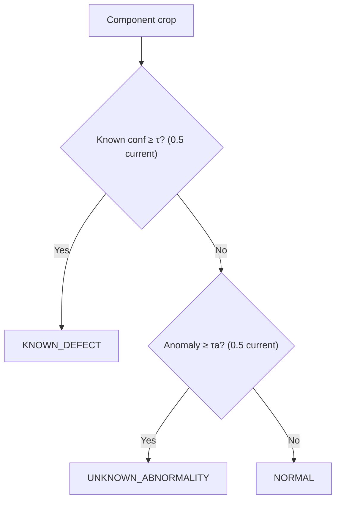

# RailSafe — Full Architecture, Detection & Risk Pipeline

> Single reference for how RailSafe turns raw inspection images into a ranked maintenance queue.
> Code refs are to the actual repo. Formulas marked **prototype** are decision-support weights, not railway safety limits.
> Status: **v1 implemented** (single-inspection, no temporal). Temporal path is **gated** until repeated-observation data exists.

---

## 0. One-line pitch

> YOLO finds the *component*, RailSense checks if it *looks normal*, fusion + severity + risk tell you *what to inspect first — and why*.

## 1. End-to-end pipeline (10 stages)

```mermaid
flowchart TD
    A["0. Input<br/>image / video frames + GPS + chainage + track/line"] --> B["1. Preprocess<br/>resize / normalize"]
    B --> C["2. Component Detection (L1)<br/>YOLO: rail / fastener / sleeper / fishplate<br/>ml/component_detection/ + scripts/train.py"]
    C --> D1["3a. Known-Defect Head<br/>YOLO-cls multiclass (current)<br/>Normal / Fastener_defective / Rail_defective"]
    C --> D2["3b. Anomaly Engine (L2)<br/>RailSense ResNet50 AE (normal-only)<br/>ml/anomaly_detection/railsense/"]
    D1 --> E["4. Evidence Fusion<br/>KNOWN_DEFECT / UNKNOWN_ABNORMALITY / NORMAL<br/>docs/architecture/hybrid-fusion.md"]
    D2 --> E
    E --> F["5. Localization<br/>bbox [x,y,w,h] + heatmap + affected_area<br/>docs/architecture/localization.md"]
    F --> G["6. Condition Ct=[A,D,S,L,Q]<br/>docs/architecture/severity.md"]
    G --> H["7. Severity S=w1D+w2A+w3G+w4C<br/>ml/severity/severity_engine.py"]
    H --> I["8. Asset Registry<br/>component_id + chainage/GPS/track<br/>PostGIS, docs/architecture/asset-registry.md"]
    I --> J{"9a. History?"}
    J -->|No (v1 current)| K["9b. Risk v1 R=w1S+w2C+w3A+w4L<br/>ml/risk/risk_engine.py"]
    J -->|Yes (v2 gated)| L["9c. Temporal: association + deterioration<br/>ml/temporal/*.py (stub)"]
    L --> M["9d. Risk v2 R=w1S+w2D+w3C+w4A+w5L"]
    K --> N["10. Dashboard + Queue<br/>sort by R desc, FastAPI /queue, React+Leaflet"]
    M --> N
```

Stage → code:

| Stage | Code | Output |
|---|---|---|
| Preprocess | `ml/dataset_tools/*`, Ultralytics resize/imgsz 224 | normalized crop/frame |
| Component det | `scripts/train.py --task multiclass/yolo`, `ml/component_detection/train.py` (RFDD stub) | `[{component_type, bbox, confidence}]` |
| Known defect | `experiments/results/best_*_cls.pt`, `scripts/test_results_model.py`, `scripts/compare_models.py` | `{type, confidence}` |
| Anomaly | RailSense `src/model.py/scoring.py` (external repo) wired via `ml/pipeline/integrated_pipeline.py` | `{anomaly_score 0..1, heatmap, method, threshold}` |
| Fusion | `ml/pipeline/integrated_pipeline.py:run_pipeline()` + `backend/api/main.py:_process_one()` | `{status, known_defect, anomaly}` |
| Severity | `ml/severity/severity_engine.py:compute_severity()` | `{severity 0..1, level, contributors}` |
| Risk | `ml/risk/risk_engine.py:compute_risk_v1()` | `{risk 0..100, level, recommendation, contributors}` |
| Queue/API | `backend/api/main.py:/queue /stats /inspections POST /inspections` | sorted queue + stats |
| UI | `frontend/src/*` (React+Vite+Tailwind+Leaflet+Recharts) | map + detail + queue |

---

## 2. Layer 1 — Component detection (where + what)

**Why first:** RailSense was trained on 256×256 component *crops* (controlled proxy). Feeding full scenes (multiple components, varying scale) directly destroys performance. Detection → crop isolates each physical part and enables component-specific anomaly models (H2).

**Current (v1, implemented):**
- YOLO **classification** heads on cropped/single-component images (Ultralytics `YOLO(...).predict`, `res.probs.top1/top1conf`).
- Active head: **multiclass 3-class** — `Normal / Fastener_defective / Rail_defective` from `datasets/yolo_multiclass/` (symlink view over `datasets/kaggle_multiclass/`). `surface_data.yaml`/7-class surface-faults head **dropped** (blurry, duplicated video frames, 3 classes with <50 images).
- Train: `python scripts/train.py --task multiclass --epochs 10 --model yolo11n.pt` (auto-switches `yolo11n.pt → yolo11n-cls.pt`). Splits grouped by `sequence_id` (never random frames) — see `ml/dataset_tools/convert_to_manifest.py:assign_grouped_splits()`.

**Future (gated on RFDD download):**
- YOLO **detection** (bbox) on full scenes: `ml/component_detection/train.py` stub → `YOLO("yolo11m.pt").train(data="datasets/rfdd/data.yaml", imgsz=640)`. RFDD = 1,350 imgs 2048×2021, 6 classes (Normal/Missing/Reversed/Displaced/Deformed/Broken), 8,100+ instances, pixel masks+boxes, 8.24 GB via ScienceDB `10.57760/sciencedb.msdc.00071` (manual download, see `datasets/download_rfdd.sh`). Then `detector.predict(frame) → [{component_type, bbox, confidence}]`, NMS, crop per bbox for Layer 2.
- Comparison: RT-DETR vs YOLO (Exp 3), cross-dataset train-RFDD→test-others (H4). Metrics: `mAP@50, mAP@50:95, P/R/F1`.

**Interface:**
```python
# classification (current)
res = yolo.predict(str(image), verbose=False)[0]
defect_type = yolo.names[res.probs.top1]       # e.g. "Rail_defective"
defect_conf = float(res.probs.top1conf)        # e.g. 0.93
# detection (future, RFDD)
detections = detector.predict(frame)           # [{"component_type":"fastener","bbox":[x,y,w,h],"confidence":0.97}]
crops = [crop_frame(frame, d["bbox"]) for d in detections]  # → 256×256 for RailSense
```

---

## 3. Layer 2 — Anomaly engine / RailSense (does it look normal?)

**Core idea:** train on **normal only**; poor reconstruction = anomaly. Catches *novel* defects outside the fixed class list (Contribution A).

**Locked baseline (RailSense main branch, MIT, 51 commits — not legacy InceptionV3):**
- Encoder: ResNet50 ImageNet-pretrained, truncated at `conv4_block6_out`, **frozen** (Stage 1 decoder-only; Stage 2 optional finetune from `conv4_block4` at `1e-5`, BatchNorm frozen).
- Bottleneck: 1×1 `LATENT_DIM` → symmetric transposed-conv decoder → 256×256×3 reconstruction Î.
- Loss: hybrid structural `α·(1-SSIM) + (1-α)·L1` (structure over raw pixels).
- Data: `datasets/railsense/<component>/{normal,damaged}/` (crossties 222 / fasteners 257 / fishplates 255 / tracks 124); only normal in train/val; test = leftover normal + all damaged; Albumentations (flip/brightness/motion-blur/shadow/noise/perspective).
- Scoring (`src/scoring.py`): `global_mse` | `topk` (worst-pixel mean, avoids background washout) | `ssim_map` (top-k of 1-SSIM).
- Threshold: `mean + k·std` on **validation-normal** scores (per component, PR-curve tuned, never hardcoded 0.5).
- Eval: ROC-AUC, AP (+prevalence floor, AP-lift), recall@P≥0.90, latency, triptychs `Original|Reconstruction|Heatmap` + `best_model_metadata.json`. CLI: `python main.py both --wandb`.
- Alternatives (Exp 2, via anomalib): PaDiM (ICPR 2020, ~0.945 AUROC) vs PatchCore (CVPR 2022, ~0.98–0.99, memory-bank + coreset NN). H2: component-specific models > generic.

**Contract:**
```python
result = anomaly_model.predict(component_crop)  # 256×256×3, ImageNet norm
# {"anomaly_score":0.78, "status":"ANOMALY"|"NORMAL",
#  "heatmap":"output/heatmaps/xxx.png", "method":"ssim_map"|"topk"|"global_mse",
#  "threshold":0.52, "confidence":0.82}
# skip if crop<32px or det-conf<0.3 → {"anomaly_score":None,"status":"SKIPPED"}
```

**Current wiring gap (honest):** `ml/pipeline/integrated_pipeline.py:36` and `backend/api/main.py:105` use a **heuristic stand-in** until TF inference is wired: `Cracks/Squats/Broken→0.85, Flakings/Shellings→0.45, else 0.25`. Replace with `railsense.predict(crop)` per `docs/architecture/anomaly.md:64` before claiming anomaly results.

---

## 4. Known-defect head + fusion (Contribution A)

Supervised head answers *what/where (known)*; anomaly answers *normal? (open-set)*. Fusion covers both.



Fusion record:
```json
{"component_type":"fastener","known_defect":"displaced","known_defect_confidence":0.93,"anomaly_score":0.81,"status":"KNOWN_DEFECT","bbox":[x,y,w,h],"heatmap_path":"heatmaps/f42.png"}
{"component_type":"fastener","known_defect":null,"known_defect_confidence":0.12,"anomaly_score":0.81,"status":"UNKNOWN_ABNORMALITY","bbox":[x,y,w,h],"heatmap_path":"heatmaps/f43.png"}
```
Thresholds τ/τa are per-component validation choices (report PR curves). Exp 4 metric: abnormality recall/F1 where abnormal = `known ∪ (anomaly≥τa)` — tests H1 (anomaly adds coverage).

---

## 5. Localization (bbox + heatmap → affected area)

| Type | Source | Output |
|---|---|---|
| Detector box | YOLO det (future RFDD); current cls mocks `[0,0,224,224]` | component extent |
| Anomaly map | per-pixel `D(I,Î)` / 1-SSIM, Gaussian-blurred, red=high error | `heatmap H×W`, overlay alpha on crop, saved to `observations.heatmap_path` |

Affected area (severity input G):
```
affected_area = #(heatmap > τh) / #(pixels in crop)   # τh per-validation
```
Current code mocks it per defect (`Cracks 0.27, Squats 0.31, …` in pipeline/backend) — replace with real heatmap thresholding once RailSense wired. Call it *anomaly localization map*, not segmentation, until validated vs RFDD masks (Exp 5: IoU / pixel-AUROC / AUPRO where masks exist).

---

## 6. Condition Ct (per-observation state)

```python
Ct = [At, Dt, St, Lt, Qt]
# At anomaly, Dt defect(type+conf), St severity, Lt localization(bbox+heatmap+area), Qt confidence
{"component_id":"FST-1821","anomaly_score":0.78,"defect":"displaced","defect_confidence":0.93,
 "severity":0.76,"condition":"degraded","bbox":[x,y,w,h],"heatmap_path":"heatmaps/FST-1821_....png"}
```
Persisted per observation; history of Ct per `component_id` is what enables temporal (v2).

---

## 7. Severity engine — Layer 3 (`ml/severity/severity_engine.py`)

Fuses CV evidence + engineering prior. **Never `Severity = Anomaly` alone.**

```
S = w1·D + w2·A + w3·G + w4·C,  S∈[0,1]
D defect-type score, A anomaly, G affected area, C component criticality
default weights (0.30, 0.35, 0.15, 0.20) — prototype
LOW <0.25 / MEDIUM <0.50 / HIGH <0.75 / CRITICAL ≥0.75
```

Tables (code-locked):
```python
DEFECT_SCORES = {Normal:0.0, Missing:0.95, Reversed:0.6, Displaced:0.7, Deformed:0.8, Broken:0.95,
                 Grooves:0.5, Joints:0.3, Cracks:0.85, Flakings:0.6, Shellings:0.65, Spallings:0.75, Squats:0.8}
CRITICALITY = {rail:0.95, fastener:0.85, sleeper:0.80, fishplate:0.85}  # engineering prior, not CV
```

Worked example (rail, Rail_defective≈Squats 0.80, A=0.85, G=0.31, C=0.95):
```
S = .30×.80 + .35×.85 + .15×.31 + .20×.95 = .240+.298+.047+.190 = .775 → CRITICAL
contributors {D:.240, A:.298, G:.047, C:.190}
```
Returns `{"severity":0.775,"level":"CRITICAL","contributors":{...}}` — contributors flow into risk explanation. Exp 6: anomaly-only vs +defect vs +area+criticality (MAE/RMSE/wF1); key Q: does area+criticality improve ranking over anomaly alone?

---

## 8. Asset registry (Contribution B: image→asset)

Ephemeral image results attach to persistent `component_id` (`FASTENER-001821, RAIL-004102, …`).

```
LINES→TRACKS→COMPONENTS→INSPECTIONS→OBSERVATIONS→(ANOMALIES, SEVERITY); COMPONENTS→RISK
COMPONENTS(component_id PK, type, track_id FK, chainage_m, lat, lon, criticality)
OBSERVATIONS(observation_id PK, component_id FK, inspection_id FK, anomaly_score, defect_type, severity, bbox, heatmap_path)
```

Spatial triple (GPS alone insufficient): `{line, track, chainage_m (authoritative ordering), lat, lon}` → PostgreSQL 14+PostGIS 3 (SQLAlchemy). v1 ingest: chainage-window match (`chainage±Δ` + track → update else create). v2: full association (below). API: `GET /assets?line=&chainage_from=&chainage_to=`, `GET /assets/{id}`, `GET /assets/{id}/history`, `POST /inspections`.

---

## 9. Temporal — Layer 4 (GATED, stubs only)

Requires Dataset G: `asset_id+timestamp+image+location+condition`, ≥4 obs/asset. Do not fake (no cross-asset pairing, no synthetic cracks).

Association (`ml/temporal/association.py` stub): `Aij = wg·Gij + wv·Vij + ws·Sij` (G spatial chainage/GPS, V visual DINOv2/ResNet cosine, S geometric bbox) + Hungarian; eval P/R/F1/ID-switches (Exp 7).
Deterioration (`ml/temporal/deterioration.py` stub): baseline linear `C(t)=β0+β1·t` (β1>0 deteriorating), then EMA/Kalman; LSTM/Transformer only if n supports. Metrics MAE/RMSE/R²/Spearman (Exp 8).
Collection: (1) partner repeated route Wk1/3/6/9 + GPS/chainage, (2) controlled rig normal→severe (labeled controlled), (3) repeated video + proven re-association.

---

## 10. Risk engine + prioritization — Layer 5 (`ml/risk/risk_engine.py`, Contribution C)

```
v1 (current, D=0): R = w1·S + w2·C + w3·A + w4·L,  default (.40,.25,.20,.15)
v2 (gated):        R = w1·S + w2·D + w3·C + w4·A + w5·L
R∈[0,100]; LOW 0–25 → CONTINUE ROUTINE MONITORING; MEDIUM 25–50 → SCHEDULED INSPECTION;
HIGH 50–75 → PRIORITY INSPECTION; CRITICAL 75–100 → URGENT FIELD INSPECTION
```

Worked example (from §7: S=.775, C=.95 rail, A=G=.31, L=.60):
```
R = .40×.775 + .25×.95 + .20×.31 + .15×.60 = .310+.238+.062+.090 = .700 → 70.0 HIGH → PRIORITY INSPECTION
contributors {S:31.0, C:23.8, A:6.2, L:9.0}
```
Output: `{"risk":70.0,"level":"HIGH","recommendation":"PRIORITY INSPECTION","contributors":{...}}` + human reason (defect 0.93, anomaly trend, area, criticality). Queue = sort all assets by R desc, top-K (`backend/api/main.py:/queue` assigns `priority=i+1`; `/stats` counts; `POST /inspections` batch-uploads). Ops eval (Exp 9): `Precision@K/Recall@K/NDCG@K` vs expert critical set; ablations A–E isolate each layer's ranking lift. Risk stored per asset (latest) + per observation for trend explanations.

---

## 11. Worked single-image trace (current code path)

Upload `rail_img.JPEG` @ chainage 124320 UP/LINE-01 → `POST /inspections` → `_process_one()`:
1. YOLO-cls → `{Rail_defective, 0.93}`; heuristic anomaly 0.85, area 0.31 → status KNOWN_DEFECT (conf≥.5).
2. `compute_severity(0.85,"Rail_defective"≈0.80,0.31,"rail")` → S=.775 CRITICAL (§7).
3. `compute_risk_v1(.775,.95,.31,L=.60)` → R=70.0 HIGH (§10).
4. Saved `experiments/results/pipeline/.json` (+ `uploads/` image), served via `/queue` (sorted), `/stats`, `/image/{path}`, React map pin (orange HIGH) + queue row + detail with contributors + recommendation.

---

## 12. Deployment & file map

Edge vehicle (camera+GPS+Jetson YOLO) → ingest → FastAPI (`backend/api/main.py`, services, SQLAlchemy+PostGIS+optional Redis) → React18+Vite5+Tailwind+Leaflet/Recharts (`frontend/`) + W&B tracking. Stack locked in `docs/architecture/tech-stack.md` (Py3.10+, torch, ultralytics≥8.3 YOLO11, anomalib≥1.0, PG14+PostGIS3, Node20).

Key files: `ml/pipeline/integrated_pipeline.py` (batch demo) · `ml/severity/severity_engine.py` · `ml/risk/risk_engine.py` · `ml/temporal/{association,deterioration}.py` (gated stubs) · `ml/dataset_tools/{convert_to_manifest,prepare_yolo}.py` · `scripts/{train,setup_kaggle,publish_dataset_kaggle,test_results_model,compare_models}.py` · `backend/{api/models/schemas/services}` · `docs/architecture/{overview,anomaly,component-detection,hybrid-fusion,localization,severity,temporal,risk,asset-registry,dashboard,tech-stack}.md` · `docs/research/*` (RQs, experiments, eval, leakage, claims) · `docs/datasets/*`.

**Limits (read before citing):** anomaly/area currently heuristic mocks (§3,§5) — wire RailSense before eval claims; S/R weights prototype; heatmap≠segmentation; no temporal until Dataset G; surface-faults removed for quality; RFDD pending manual ScienceDB pull; v1 is *condition monitoring + decision support*, not predictive maintenance.
