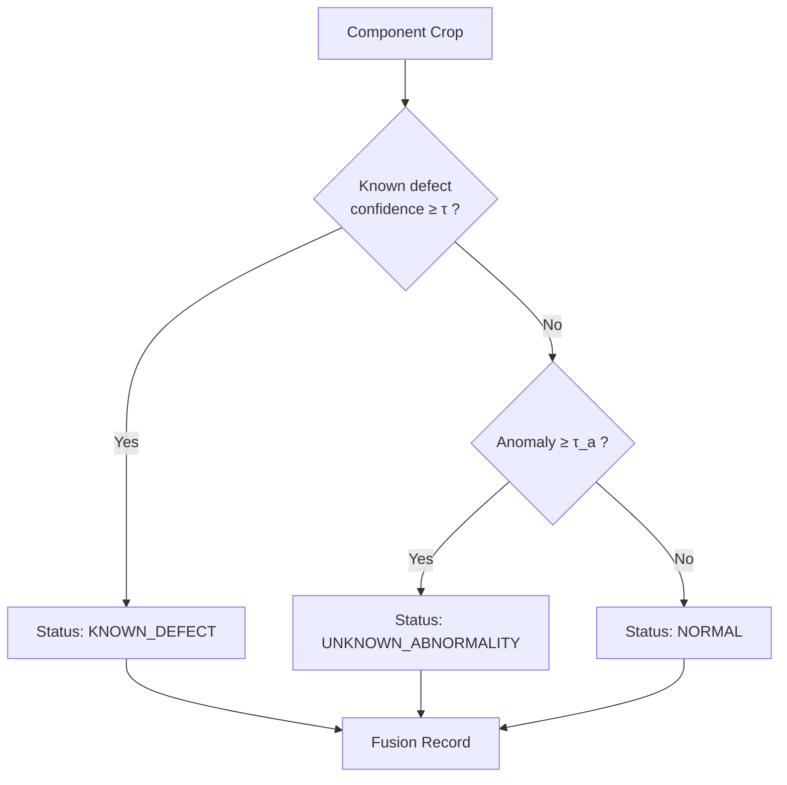
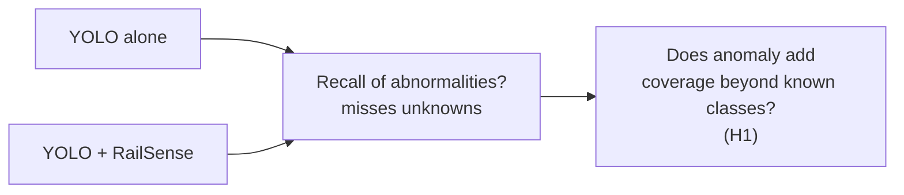

# Hybrid Detection & Evidence Fusion

## 1. Motivation

Supervised detector catches **known** defects. Anomaly detector catches **unknown / novel** abnormalities. Fusion gives coverage of both.

## 2. Logic



## 3. Fusion Record

```json
{
  "component_type": "fastener",
  "known_defect": "displaced",
  "known_defect_confidence": 0.93,
  "anomaly_score": 0.81,
  "status": "KNOWN_DEFECT",
  "bbox": [x, y, w, h],
  "heatmap_path": "heatmaps/frame0421_fastener3.png"
}
```

```json
{
  "component_type": "fastener",
  "known_defect": null,
  "known_defect_confidence": 0.12,
  "anomaly_score": 0.81,
  "status": "UNKNOWN_ABNORMALITY",
  "bbox": [x, y, w, h],
  "heatmap_path": "heatmaps/frame0422_fastener1.png"
}
```

## 4. Thresholding

- `τ` (known defect) and `τ_a` (anomaly) chosen on validation per component type.
- Report PR curves; do not fix thresholds arbitrarily.

## 5. Experiment (Exp 4)



Metric: overall abnormality recall / F1 where abnormality = `known_defect ∪ (anomaly ≥ τ_a)`.

## 6. Implementation

```python
# ml/defect_detection/fusion.py (or ml/severity/evidence_fusion.py)
def fuse(known_result, anomaly_result) -> dict:
    ...
```

Fusion is stateless per crop; temporal association happens downstream.
