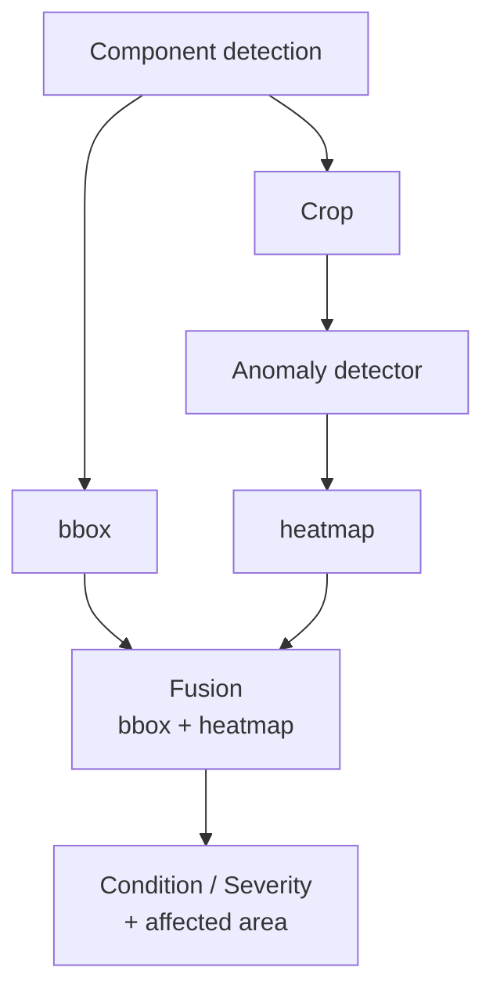
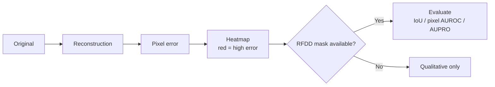

# Localization

## 1. Two Complementary Localizations

| Type | Source | Output | When to Use |
|---|---|---|---|
| **Detector localization** | YOLO bbox | `bbox [x,y,w,h]` | Always (component extent) |
| **Anomaly localization** | Reconstruction error heatmap | `heatmap (HxW)` | When anomaly detector is run |



## 2. Heatmap Semantics

Do not claim heatmap is exact defect segmentation. Call it **anomaly localization map** unless validated against pixel masks.



## 3. Affected Area

Derived from heatmap thresholding:

```text
affected_area = (# pixels with error > τ_h) / (# pixels in crop)
```

Used in severity: `G` (geometry/extent). Threshold `τ_h` per validation.

## 4. Evaluation (Exp 5)

Where pixel masks exist (RFDD):

- `IoU` (bbox vs mask)
- `pixel AUROC`
- `AUPRO` (per-region overlap)

Where no masks: qualitative examples + anomaly score correlation with defect presence.

## 5. Visualization

Overlay heatmap on original crop with alpha blending; store under `observations.heatmap_path`.
