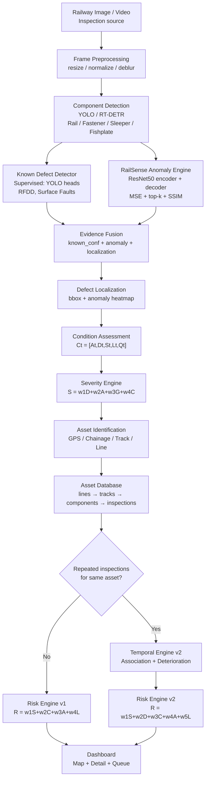
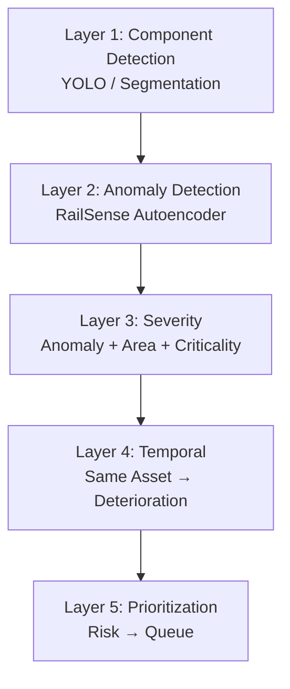
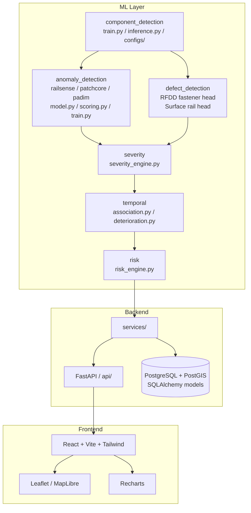
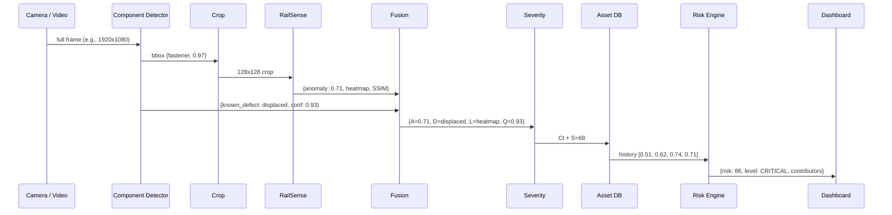
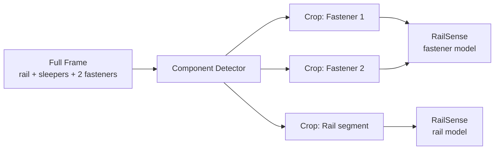
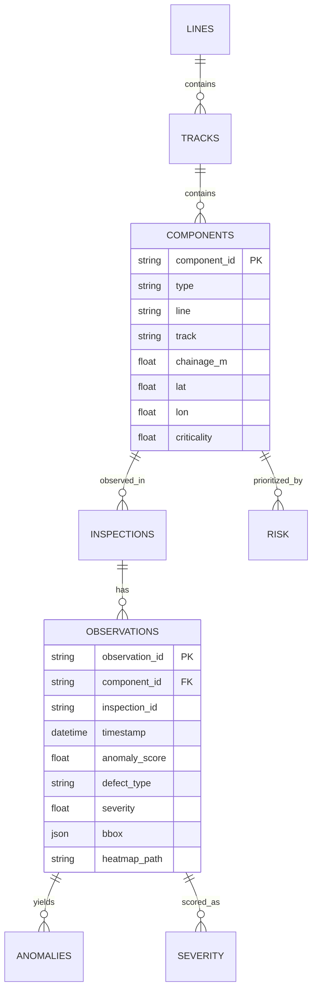
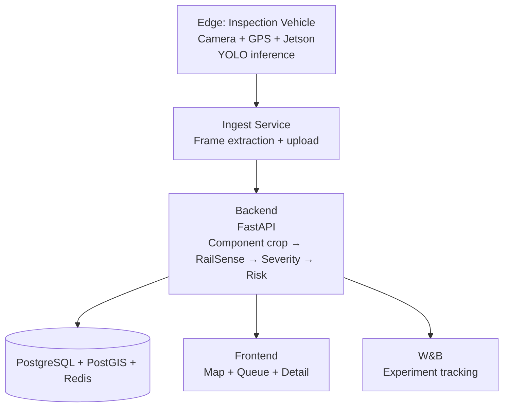

# Architecture Overview

## 1. End-to-End Flow

## 2. Five Layers (Simplified)

## 3. Component View

## 4. Data Flow — Single Component Example

## 5. Why Detector Before Anomaly

Real inspection frames are full scenes with multiple components at varying scales. RailSense was trained on component crops in a controlled proxy environment. Without detection → cropping, full frames would be fed to a crop-trained autoencoder, destroying performance.

This also enables **component-specific anomaly models** (H2: component-specific > generic).

## 6. Asset-Centric vs Image-Centric

## 7. Deployment Topology (Conceptual)

## 8. Key Design Constraints

- **No temporal inference without asset association** — temporal path is gated.
- **Prototype weights** — severity/risk weights are experimental, not safety thresholds; must be documented as such.
- **Heatmap ≠ segmentation** until validated against RFDD pixel masks.
- **PostGIS required for spatial queries** — chainage + GPS + track ID together, not GPS alone.
