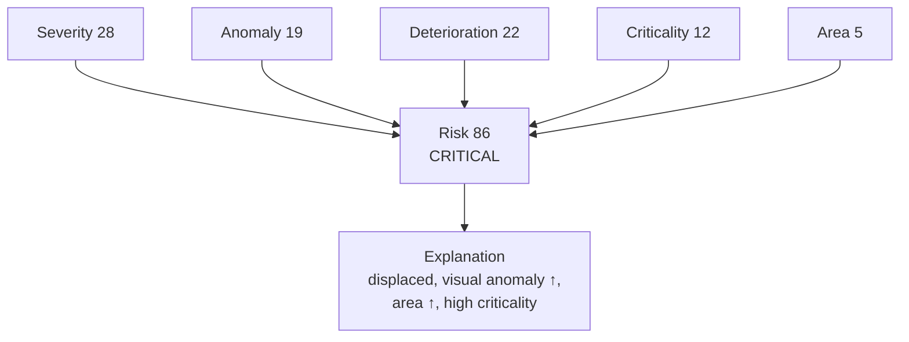
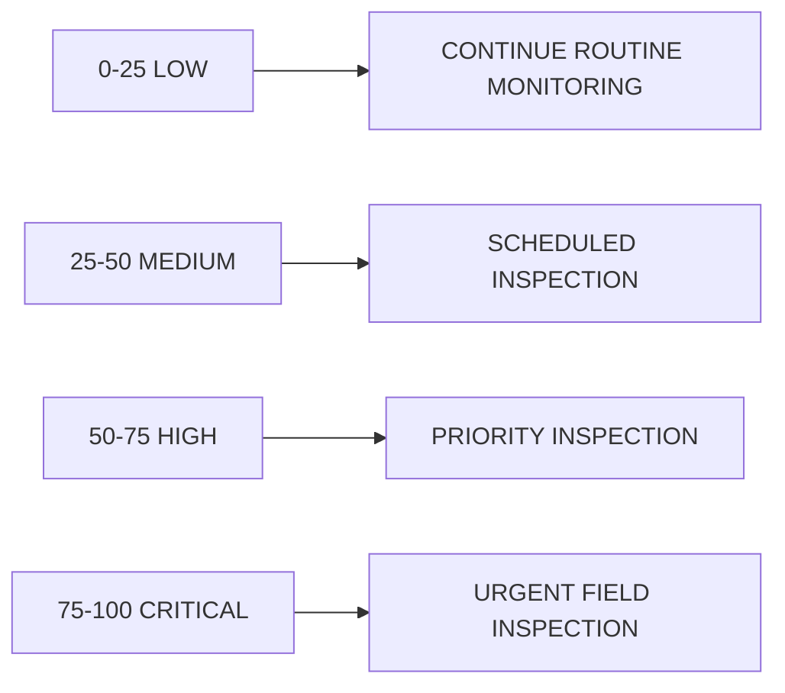
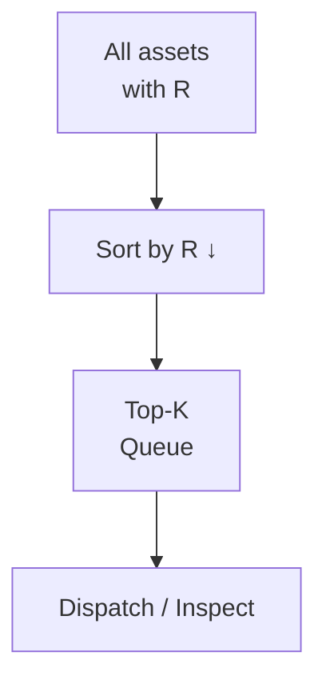

# Risk Engine & Maintenance Prioritization — Layer 5

## 1. Purpose

Convert condition + context into an **explainable, ranked queue** so limited maintenance resources go to the right assets first.

RailSafe **supports** decisions; it does not autonomously order maintenance.

## 2. Risk Formula

```
R = w1·S + w2·D + w3·C + w4·A + w5·L
```

- `S` = severity
- `D` = deterioration (gated; 0 in v1)
- `C` = component criticality (engineering prior)
- `A` = affected area
- `L` = location / contextual factor (e.g., subgrade history, traffic)

Normalized:

```
R ∈ [0, 100]
```

Categories (prototype, explicitly **RailSafe decision-support thresholds**, not railway safety limits):

```text
0–25    LOW
25–50   MEDIUM
50–75   HIGH
75–100  CRITICAL
```

Weights are prototype/experimental; document and justify. In v1, `w2 = 0` (no deterioration).

## 3. Explainability (Required)

Every score decomposes into contributors:



Example output:

```text
FASTENER-001821 — Risk 86 / CRITICAL

Contributors:
  Current severity      28
  Anomaly evidence      19
  Deterioration         22
  Component criticality 12
  Affected area          5

Reason:
• displaced fastener detected (0.93)
• anomaly increased over previous inspections
• affected area increased
• component classified as high criticality

Recommendation: URGENT FIELD INSPECTION
```

## 4. Recommendation Mapping



Wording must emphasize decision support.

## 5. Prioritization

Given `N` assets, sort descending by `R` and take top-K.



This is the experiment that matters most for operations (Exp 9).

## 6. Evaluation (Exp 9)

Assume limited inspection capacity `K`. Compute against ground-truth / expert high-critical set:

```
Precision@K, Recall@K, NDCG@K
```

Question: *How many of the top-20 RailSafe priorities are actually high/critical?* More meaningful than generic accuracy.

Ablation A-E validates contribution of each layer to ranking (see `research/experiments.md`).

## 7. Interfaces

```python
# ml/risk/risk_engine.py
def compute_risk(severity, deterioration, criticality, affected_area, location_factor, weights):
    # -> {"risk": float, "level": str, "contributors": dict, "recommendation": str}
```

Risk is stored per asset (latest) and per observation; history enables trend in explanation.
