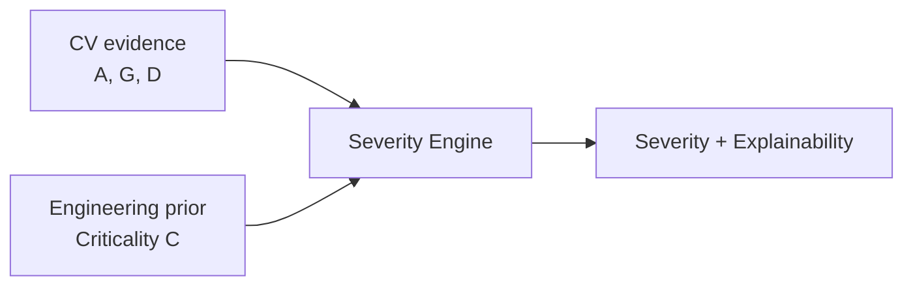

# Condition & Severity — Layer 3

## 1. Condition Representation

Per component observation:

```
Ct = [At, Dt, St, Lt, Qt]
```

- `At` = anomaly score
- `Dt` = defect information (type + confidence)
- `St` = severity
- `Lt` = localization (bbox + heatmap)
- `Qt` = prediction confidence

```json
{
  "component_id": "FST-1821",
  "anomaly_score": 0.78,
  "defect": "displaced",
  "defect_confidence": 0.93,
  "severity": 0.76,
  "condition": "degraded",
  "bbox": [x, y, w, h],
  "heatmap_path": "heatmaps/FST-1821_2026-09-10.png"
}
```

## 2. Severity Formula (Prototype)

Do not set `Severity = Anomaly`. Severity fuses multiple evidence types:

```
S = w1·D + w2·A + w3·G + w4·C
```

- `D` = defect type criticality (e.g., `fractured` > `displaced` > `intact`)
- `A` = anomaly intensity
- `G` = geometry / affected area
- `C` = component criticality (engineering prior, not CV output)

**Weights are prototype/experimental**, not railway safety thresholds. Document values and justify.

Example:

```text
Anomaly 0.82 + Affected area 0.27 + Defect type 0.90 + Criticality 0.85
  → Severity: HIGH (prototype)
```

Categories (prototype):

```text
0–25  NORMAL
25–50 LOW
50–75 HIGH
75–100 CRITICAL
```

Empirically calibrate boundaries; do not hardcode without validation.

## 3. Component Criticality (Independent Prior)

Conceptual scale (requires domain justification):

```text
Fastener   High
Rail       Very High
Sleeper    High
Fishplate  High
```

Criticality should be supplied from engineering context, not inferred by the CV model.



## 4. Implementation

```python
# ml/severity/severity_engine.py
def compute_severity(anomaly: float, defect_type: str, affected_area: float,
                     criticality: float, weights: dict) -> dict:
    # returns {"severity": float, "level": str, "contributors": dict}
```

Contributors decomposition is required for explainability downstream.

## 5. Evaluation (Exp 6)

Compare:

- Anomaly-only vs `anomaly + defect type` vs `anomaly + defect + area + criticality`

Metrics: `MAE, RMSE, weighted F1` against expert / synthetic severity labels. Primary question: does adding area + criticality improve ranking vs anomaly alone?

## 6. Storage

Severity lives on `observations.severity` and feeds risk engine.
