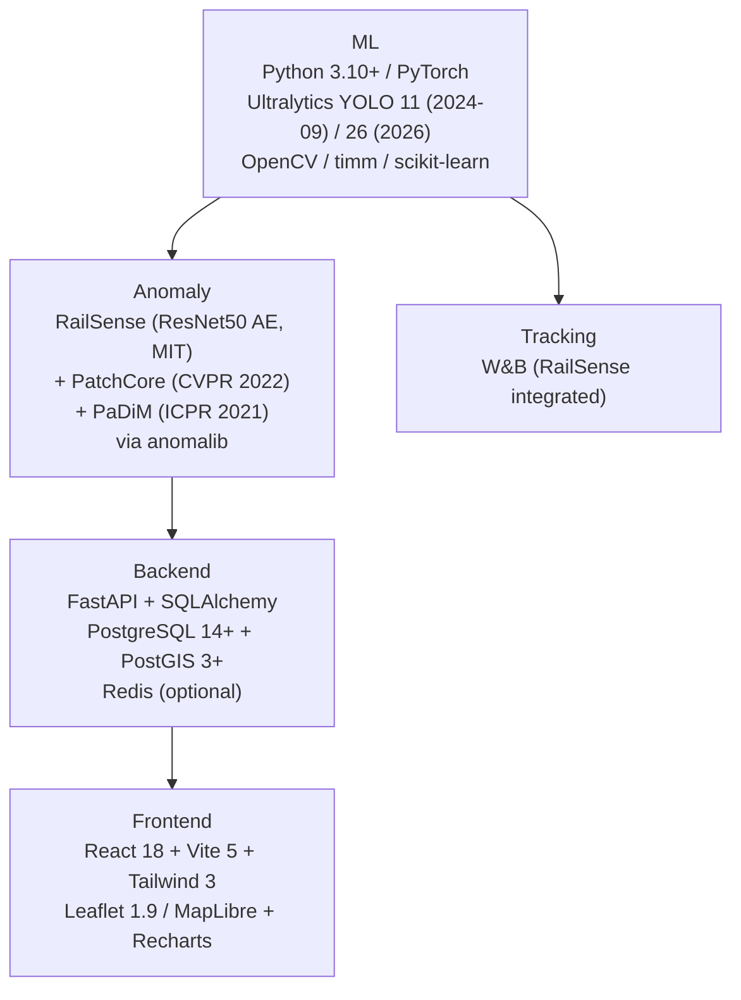

# Technology Stack (Verified 2026-09-15, Locked)

## 1. Stack by Layer (Locked Versions)



## 2. Verified Details

| Layer | Locked Choice | Verification | Why Locked |
|---|---|---|---|
| Detector | **Ultralytics YOLO11 (Sept 2024) primary**, YOLOv8 fallback; YOLO26 (2026) noted as flagship but YOLO11 is stable release. Compare with **RT-DETR** in Exp 3. | Ultralytics Roadmap fetch: YOLO11 Sep 2024, 39.5-54.7 mAP (COCO), 22% faster than v8, supports detect/segment/obb/pose; YOLO26 is 2026 VLM generation | RFDD benchmarks use YOLOv8m/v9c/v10m/v11m + RT-DETR (GH README: 0.9668 mAP50 YOLOv9c best, 0.7106 mAP50:95 YOLO11m best) — Ultralytics is canonical package |
| Anomaly | **RailSense (ResNet50 AE, MIT, 51 commits)** primary; **PatchCore (CVPR 2022) + PaDiM (ICPR 2021)** via **anomalib** for Exp 2 | RailSense fetch: ResNet50 truncated conv4_block6_out, 256×256×3, α·(1-SSIM)+(1-α)L1, global_mse/topk/ssim_map; anomalib fetch: MVTec benchmark PatchCore ~0.98-0.99 AUROC, PaDiM ~0.945 | RailSense already integrates W&B; PatchCore/PaDiM are SOTA on MVTec per anomalib tables |
| Backend | **FastAPI + SQLAlchemy + PostgreSQL 14+ + PostGIS 3+** | Standard for spatial `chainage + GPS` queries; Training Rails ref uses FastAPI | Required for `asset_id` + `chainage_m` + `track/line` indexing |
| Frontend | **React 18 + Vite 5 + Tailwind 3 + Leaflet 1.9 / MapLibre + Recharts** | — | Map + trend charts for dashboard |
| Tracking | **W&B** | RailSense `src/logger.py --wandb` | One-variable-per-run workflow, ROC-AUC north star |
| Licenses | **YOLO AGPL-3.0 (open) vs Enterprise (commercial)**; **RailSense MIT**, **RFDD MIT**, **Rail-DB MIT**, **Surface CC BY 4.0** | Ultralytics LICENSE page via GH (60k★) | Must choose license per deployment |

## 3. Reusable Repos (Verified)

| Repo | Stars | Use | URL | License |
|---|---|---|---|---|
| RailSense | 6★, 51 commits | Anomaly engine, scoring, heatmaps, W&B | https://github.com/kashtennyson/RailSense | MIT |
| RFDD | 2★, 23 commits | Fastener baselines (YOLO/RT-DETR), masks | https://github.com/NIM-NMDC/RFDD + ScienceDB 10.57760/sciencedb.msdc.00071 | MIT |
| Rail-Detection | 96★, 26 commits | Rail geometry, Rail-DB, Rail-Net | https://github.com/Sampson-Lee/Rail-Detection | MIT |
| anomalib | — | PatchCore/PaDiM impl + MVTec benchmarks | https://github.com/open-edge-platform/anomalib | Apache-2.0 |
| Training Rails | — | Engineering ref YOLO→Jetson→FastAPI→React | https://github.com/chostudio/rails | — |

> Borrow Training Rails architecture; do not treat as ground truth.

## 4. Locked Environment

```text
Python 3.10+
PyTorch (CUDA 12 if GPU available)
ultralytics >= 8.3 (for YOLO11)
anomalib >= 1.0 (for PatchCore/PaDiM)
opencv-python, timm, scikit-learn, albumentations
PostgreSQL 14+ + PostGIS 3+
Node 20+ + Vite 5+ (frontend)
W&B account (for --wandb runs)
```

## 5. Alternatives Locked Out

- Detector: RT-DETR **only** as Exp 3 comparison, not primary.
- Custom PatchCore from scratch **allowed** but prefer anomalib for reproducibility.
- Map: **Leaflet** default (simpler), MapLibre if vector tiles needed — lock to Leaflet for v1.
- DB: **PostGIS from start** (not SQLite prototype) — spatial queries are core to asset registry.

## 6. YOLO Selection Guidance (for RfDD Benchmark Compatibility)

- **Primary training:** `yolo11m` (best RFDD mAP50:95 = 0.7106) for accuracy, `yolo11n` (39.5 mAP, 2.6M params) for edge/ablation.
- **Comparison:** `yolov8m` (0.9665 mAP50) as fallback if yolo11 weights unavailable; both via `ultralytics` package.
