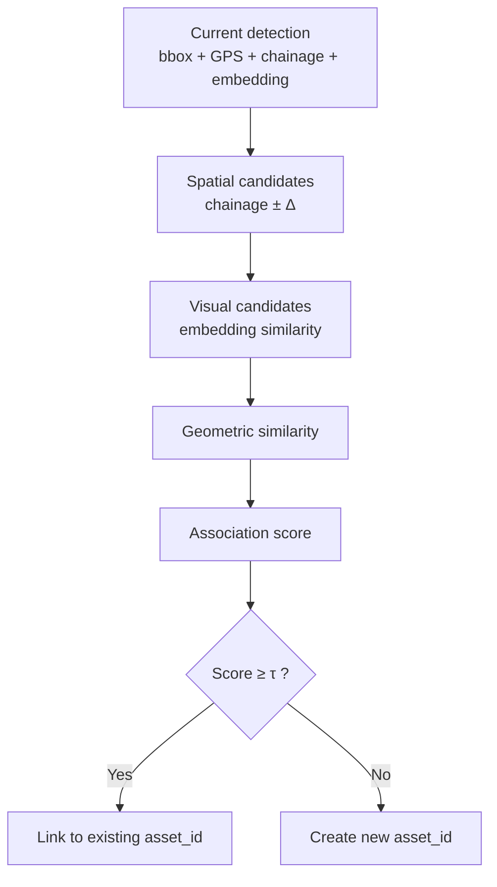
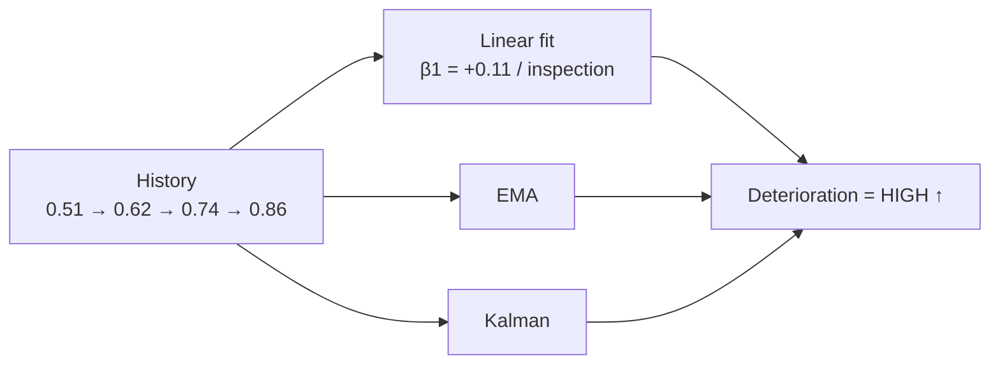
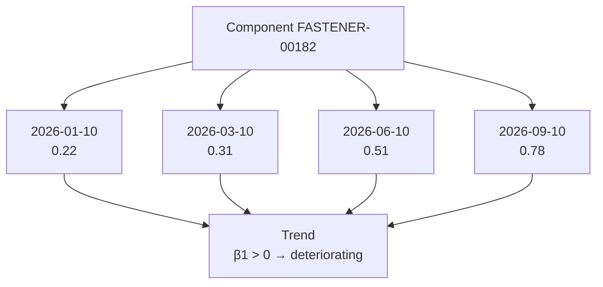

# Temporal Engine — Layer 4 [Phase 2, Gated]

> **Gated:** Do not implement or evaluate until legitimate repeated-observation data (Dataset G) exists. Architecture supports it; claims wait for data.

## 1. Purpose

Convert `current condition → condition history → deterioration → temporal risk`.

## 2. Temporal Association (Hard Problem)

Determine whether a current detection is the same physical component as a historical asset.



Association score:

```
Aij = wg·Gij + wv·Vij + ws·Sij
```

- `G` = spatial similarity (GPS/chainage distance)
- `V` = visual similarity (DINOv2 / ResNet embedding cosine)
- `S` = geometric similarity (bbox scale/position)

Implementation sketch:

```text
GPS/chainage → candidate filter
    + DINOv2/ResNet embedding → cosine similarity
    + Hungarian assignment for frame-level matching
```

Evaluation (Exp 7, after data exists):

- Compare `GPS only` vs `GPS+embedding` vs `GPS+embedding+geometry`
- Metrics: `Precision, Recall, F1, ID switches`

## 3. Deterioration Models

Once history exists:

```
D_t = f(C_{t-k}, ..., C_{t-1}, C_t)
```

### Baseline (start here)

Linear trend:

```
C(t) = β0 + β1·t
```

- `β1 ≈ 0` → stable
- `β1 > 0` → deteriorating
- `β1 < 0` → improving / recovered



Order: **linear / EMA / Kalman first**. Only then consider LSTM / Transformer if dataset size supports it. Do not start with LSTM — sophisticated model cannot compensate for missing observations.

### Simple Delta Metrics

```
ΔA = A_current − A_previous
Growth = (A_current − A_previous) / A_previous × 100%
```

Example: `0.71 → 0.83` = `+16.9%`.

## 4. Storage: History



Each `observation` already has `asset_id + timestamp + condition`.

## 5. How to Obtain Longitudinal Data (Three Legitimate Options)

1. **Partner repeated route:** same section at `Week 1, 3, 6, 9` with `camera + GPS + timestamp + chainage`.
2. **Controlled rig:** fastener staged `normal → slightly displaced → moderate → severe` (explicitly labeled as controlled, not field).
3. **Repeated video:** same route at different times + proven re-association.

Illegitimate: pairing unrelated images, synthesizing cracks, inferring deterioration from cross-asset score differences.

## 6. Evaluation (Exp 8)

Compare:

- `Current condition only` vs `Current + historical condition`
- Then `linear` vs `EMA` vs `LSTM/Transformer` (only if n sufficient)

Metrics: `MAE, RMSE, R², Spearman` for condition prediction; ranking metrics for prioritization.

## 7. Interfaces

```python
# ml/temporal/association.py
def associate(detections, assets, weights) -> list[match]

# ml/temporal/deterioration.py
def estimate_trend(history: list[float]) -> dict  # {beta1, ema, trend_label}
```
