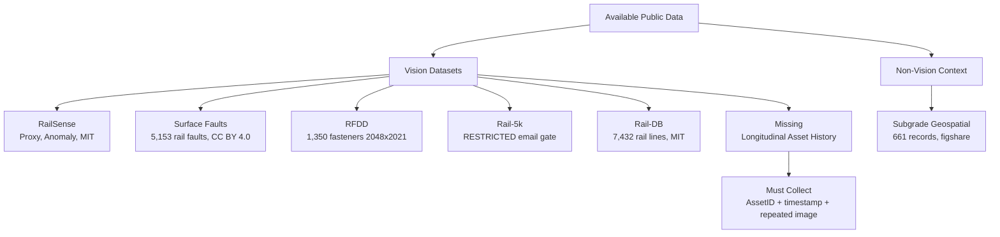
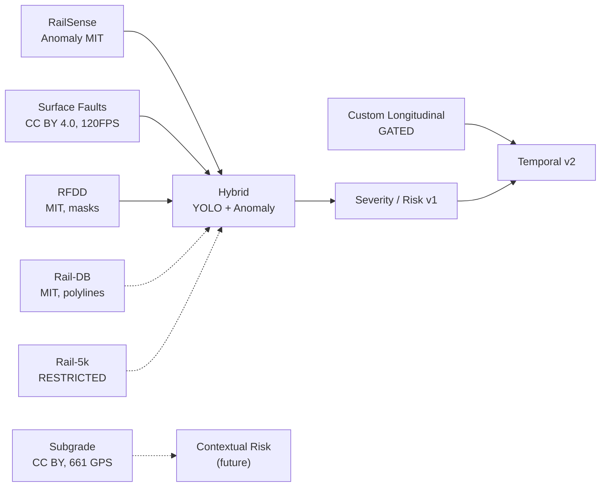

# Dataset Inventory — Phase 0 Audit (Verified 2026-09-15)

> Record for every dataset: source, license, images, classes, annotation format, field/controlled, video?, GPS?, sequence?, persistent ID?, severity?. No training before this audit is complete. All entries below verified via live web fetch on 2026-09-15.

## 1. At-a-Glance (Verified)

| # | Dataset | Source (Verified) | Images | Classes / Content | Annotation | Field / Controlled | GPS | Sequence / Video | Persistent Asset ID | Severity | License (Verified) |
|---|---|---|---|---|---|---|---|---|---|---|---|
| A | **RailSense Railway Component** | [GitHub](https://github.com/kashtennyson/RailSense) (51 commits, 6★) / [Kaggle](https://www.kaggle.com/datasets/kashtennyson/railway-component-dataset) + `dataset-metadata.json` | Component-organized (not single count): `crossties` / `fasteners` / `fishplates` / `tracks` each `normal/` + `damaged/` | 4 component types × (normal/damaged) | Image-level folders + output heatmap triptychs `output/heatmaps/` | **Controlled proxy** — README explicitly: *"proxy dataset was curated in controlled environment where four component types and damaged variants were staged"* | No | No | No | No (anomaly score only) | **MIT** (`LICENSE` in repo) |
| B | **Railway Track Surface Faults** | [Mendeley](https://data.mendeley.com/datasets/8hxtgyyxrw/2) DOI `10.17632/8hxtgyyxrw.2` Version 2 (2022-01-06) / [Data in Brief](https://doi.org/10.1016/j.dib.2024.110050) / [PMC](https://www.ncbi.nlm.nih.gov/pmc/articles/PMC10828558) — 15 citations | **5,153 images** (Data in Brief: 7 fault conditions) | **Grooves, Joints, Cracks, Flakings, Shellings, Spallings, Squats (7)** | Image-level class labels (vehicle-mounted frames); manual labeling after frame extraction | **Field** — 2× EKEN-H9R cameras @ **120 FPS**, FOV ~14 inches, mounted on railway inspection vehicle; real-world track surface faults under varied environmental/lighting | No | **Yes — video-derived** (frames from inspection vehicle video) | No | No | **CC BY 4.0** (Mendeley Data page) |
| C | **RFDD** | [GitHub](https://github.com/NIM-NMDC/RFDD) (23 commits, 2★) / [ScienceDB](https://doi.org/10.57760/sciencedb.msdc.00071) CSTR `14923.11.sciencedb.msdc.00071` / SciData descriptor | **1,350 images** at **2048×2021** — split **1,050 Train / 200 Val / 100 Test**; **>8,100 instances**; **8.24 GB**, 1 file, v1 published 2025-12-26; HDF5 (train/val) & PNG (test) | **6 classes: Normal, Missing, Inverted (=Reversed), Displaced, Deformed, Fractured (=Broken)** — strictly defined by engineering specifications / maintenance tolerances (not subjective); governed by 6 consistency principles: **Geometry, Optics, Boundary, Noise, Texture, Hierarchy** | **Pixel-level semantic masks + bounding boxes**, full-scene multi-fastener layout preserved (raw-scale) | **Field** — operational high-speed railway inspection vehicles | No | No | No | No | **MIT** (GH badge) + ScienceDB terms; weights hosted on [Baidu AI Studio](https://aistudio.baidu.com/dataset/detail/364368/intro) |
| D | **Rail-5k** | [Zenodo 4872619](https://zenodo.org/records/4872619) + [Zenodo 4872772](https://zenodo.org/records/4872772) DOI `10.5281/zenodo.4872619` / arXiv `2106.14366` | **~5,000 high-quality RGB images** (resolution up to **0.03 mm/px**), **1,100 annotated** with **13 defect/accessory types** (rail surface, contact band, crack, spalling, corrugation, fastening, screw…); 4,000 unlabeled with corruptions | 13 types: dense small objects (e.g., spalling), fine-grained, long-tailed; categories transition, different screws | **Instance-level bbox** (segmentation planned in future versions); 2 settings: fully-supervised (1k) + semi-supervised (4k uncaptured with domain shift) | **Field** — HSR + subway across China; real-world corrupted images (dark, overexposure, blur, different lens distance) | No | No | No | No | **Restricted — email application only** (Zenodo "Request access" gate, 5,470 views, 0 downloads); **BY-NC-ND 4.0** per arXiv paper (§ license of assets); **DO NOT plan as primary** |
| E | **Rail-DB** | [GitHub](https://github.com/Sampson-Lee/Rail-Detection) (96★) — ACM MM 2022 paper `arXiv:2304.05667` | **7,432 image/annotation pairs** in **9 scene categories** | Rail polylines + scene type; comparison table: 3,626 Tusimple / 133k CULane / 3k RSDS / **7,432 Rail-DB** | **Polylines** (not masks); categorized into 9 scenes; row-based selection formulation | **Field** — diverse lighting, road structures, views (sun/night/rain, line/curve/cross/slope) | No | No | No | No | **MIT** (LICENSE in repo); download via Google Form email link; pretrained models on [Google Drive](https://drive.google.com/file/d/1vd8rbUEkeoHpGP4QR0dc6LrS2un2FAF3/view?usp=sharing) |
| F | **Subgrade Defects** | [Sci Data 11:293 (2024)](https://www.nature.com/articles/s41597-024-03112-7) — figshare DOI `10.6084/m9.figshare.24086016`; 4,246 accesses, 9 citations | **661 georeferenced records** (not images) across **239 districts/counties**, from 24,735 papers (1999-2023; 179 eligible) — **8 defect types**: settlement 233 (5-2300 mm), uplift 88 (5-122 mm), frost damage 254 (4-50 mm), mud pumping 29, soil extrusion 5, slope failure 26, protection deterioration 6, poor drainage 20 | 8 types + cause (construction 73, design 54) + year + HSR line + admin levels (provincial/prefectural/county/township) + `loc_level` precision flag | **GPS (WGS84 lon/lat) + HSR mileage → lon/lat via xGeocoding (Baidu/QQ/Amap) + Google Earth**; columns: `rai_na, def_ty, lon, lat, loc_level, loc_l1-l4, def_ca, def_va, col_stt/end, pub_t/id/full/link` | **Field geospatial** — literature-extracted (WOS+CNKI), not inspection images | **Yes (WGS84)** | No | No (district-level aggregated) | Quantitative `def_va` (mm) but **not CV severity** | **Open Access, CC BY** (Nature Scientific Data); dataset on figshare |
| G | **Custom longitudinal** | To be collected (Phase 10) — see `temporal.md` | Target: **≥4 inspections × N assets** (same physical asset re-observed) | Same taxonomy as A-C | bbox/mask + condition + severity + `asset_id + timestamp + chainage + track + line` | Field or controlled rig | **Yes** | **Yes** | **Yes** | **Yes** | Internal / partner agreement |

## 2. Detailed Profiles (Verified)

### Dataset A — RailSense Railway Component

- **Verified:** Repo is *not* `RailwayTrackCrackDetection` (4★ legacy classifier InceptionV3 / 858 imgs / 7 classes) — **use `RailSense` main branch** (autoencoder). Legacy preserved on `legacy-version` branch.
- **Model (src/model.py):** Encoder **ResNet50 (ImageNet-pretrained, truncated at `conv4_block6_out`, frozen)**, 1×1 bottleneck `LATENT_DIM`, symmetric transposed-conv decoder → 256×256×3. Transfer learning for reconstruction.
- **Training (src/train.py):** Hybrid loss `α·(1-SSIM) + (1-α)·L1`; **Stage 1** decoder-only frozen encoder; **Stage 2** optional `FINETUNE` unfreezing top ResNet blocks at `FINETUNE_LR=1e-5` from `conv4_block4`, BatchNorm frozen. Callbacks: checkpoint/early-stop/LR-plateau.
- **Scoring (src/scoring.py):** `global_mse` / `topk` / `ssim_map` (top-k of 1-SSIM map). **Threshold** `mean + THRESHOLD_K·std` on validation normal scores.
- **Evaluation (src/evaluate.py):** Detection metrics **ROC-AUC, Average Precision (with prevalence floor + AP-lift), recall@precision≥0.90, precision, recall** + latency/throughput + triptychs `Original|Reconstruction|Heatmap` + `best_model_metadata.json`.
- **Inference (src/inference.py):** Single-image `NORMAL/ANOMALY + confidence + heatmap`.
- **Config/Tracking:** `src/config.py` + `src/logger.py` W&B toggle `--wandb`.
- **CLI (main.py):** `train / evaluate / predict / both` — e.g. `python main.py both --wandb --run_name exp-v1`; requirements `requirements.txt` (CUDA/CPU) + `requirements-silicon.txt`.
- **Data (src/data_loader.py):** Albumentations (flips, brightness/contrast, motion blur, shadow, noise, perspective) to simulate railway conditions.
- **Structure:** `data/<component>/{normal,damaged}/` where `<component>` ∈ `{crossties, fasteners, fishplates, tracks}`; **only normal for train/val**, test = leftover normal + all damaged, seeded reproducible.
- **Use in RailSafe:** Primary anomaly learner — train **component-specific** models per folder (H2).

### Dataset B — Railway Track Surface Faults

- **Verified size:** Mendeley Data page confirms 7 classes + 120 FPS EKEN-H9R provenance; Data in Brief paper confirms 5,153 images derived from video; CC BY 4.0.
- **Strength:** Only dataset with real inspection-vehicle capture of rail surface faults under varied conditions.
- **Leakage:** Frames from same video → **group by video** when splitting.
- **Use:** Rail-surface supervised head + external val for rail anomaly.

### Dataset C — RFDD (Lock)

- **Verified lock:** 1,350 / 2048×2021 / 8.24 GB / 1050-200-100 split / 6 classes / 8,100+ instances / HDF5+PNG / pixel masks+boxes / 6 consistency principles / MIT / ScienceDB DOI / Baidu weights — all cross-checked via GH + scidb.cn page.
- **Benchmarks (from GH README, test=100):** RT-DETR mAP50 0.9038 / mAP50:95 0.5996 ; YOLOv8m 0.9665/0.6517 ; YOLOv9c **0.9668**/0.6796 ; YOLOv10m 0.9439/0.6730 ; YOLOv11m 0.9614/**0.7106** (best 50:95) — use as reference, rerun via `aistudio.baidu.com` weights.
- **Note:** GH notice *"complete dataset and source code will be fully released upon acceptance"* — download from ScienceDB, not just GH.
- **Use:** **Primary fastener detector** + segmentation eval (IoU, pixel AUROC, AUPRO) — only dataset with pixel masks.

### Dataset D — Rail-5k (Restricted)

- **Verified:** Zenodo 4872619 older version notice → 4872772 is current version (same DOI family); both restricted with email gate; arXiv confirms 1100/5000, 13 types, 0.03mm/px, semi-supervised setting, BY-NC-ND 4.0. **4057+ views, 0 downloads** confirms restricted status.
- **Handling:** **Not primary.** Attempt access via email (`zhangzihao` / Shanghai Key Lab) but do not block v1. If granted, treat as external validation for rail surface.

### Dataset E — Rail-DB

- **Verified:** 7,432 pairs / 9 scenes / polylines / MIT / form download / Rail-Net row-based classifier (anchor classifier, reduces cost vs segmentation) / 92.77% accuracy 312 FPS lightweight / outperforms traditional +50.65% and segmentation +5.86% / cross-scene adaptation tested / backbones ResNet → ViT.
- **Use:** Optional rail geometry; not for defect classification.

### Dataset F — Subgrade Defects

- **Verified:** Sci Data paper fetch confirms 661 records / 239 locations / 8 types with counts above / WGS84 / xGeocoding + Google Earth / 4 loc_levels / cause columns / figshare DOI 10.6084/m9.figshare.24086016 /TB10621-2014 threshold caveat / bias toward studied lines. **Not CV images.**
- **Use:** Contextual risk layer only — e.g., `CV condition + geospatial history` — never merge as same asset truth.

### Dataset G — Custom Longitudinal (Gated)

- **Required fields:** `asset_id, inspection_id, timestamp, image/video, bbox/mask, defect_type, anomaly_score, severity, lat/lon, chainage_m, track_id, line_id`
- **Collection options:** (1) Partner repeated route `Week1/3/6/9` camera+GPS+chainage, (2) Controlled rig `normal→slight→moderate→severe` (explicitly labeled controlled), (3) Repeated video + proven re-association.
- **Threshold:** Need **≥4 observations per asset** to fit `C(t)=β0+β1t` and evaluate deterioration.

## 3. Dataset Role Map

## 4. What Not to Do (§14 — Enforced)

- ❌ Pair unrelated images as `t1/t2` and call it deterioration.
- ❌ Synthesize cracks via editing and claim temporal.
- ❌ Infer deterioration from anomaly differences across different assets.
- ❌ Merge geospatial defect counts with image labels as same asset truth.
- ❌ Commit raw images from restricted datasets to git.

## 5. Audit Checklist (must fill before training — now partially verified)

- [x] source URL + access date (2026-09-15) + version/commit
- [x] license: RailSense MIT, Surface CC BY 4.0, RFDD MIT, Rail-5k restricted BY-NC-ND 4.0 email gate, Rail-DB MIT, Subgrade CC BY
- [x] image count + resolution + format (see table)
- [x] class list + instance counts (7 surface, 6 RFDD, 13 Rail-5k, 9 Rail-DB scenes, 8 subgrade)
- [x] annotation format (folders / class / masks+boxes / polyline / GPS)
- [x] capture condition (proxy / vehicle / field / HSR / geospatial literature)
- [x] video/sequence (only Surface Faults has video-derived frames)
- [x] GPS (only Subgrade + future G)
- [x] persistent asset ID (only future G)
- [ ] actual download + checksum verification (next: run `datasets/download_*.sh`)
- [ ] leakage manifest generation (Phase 2)
