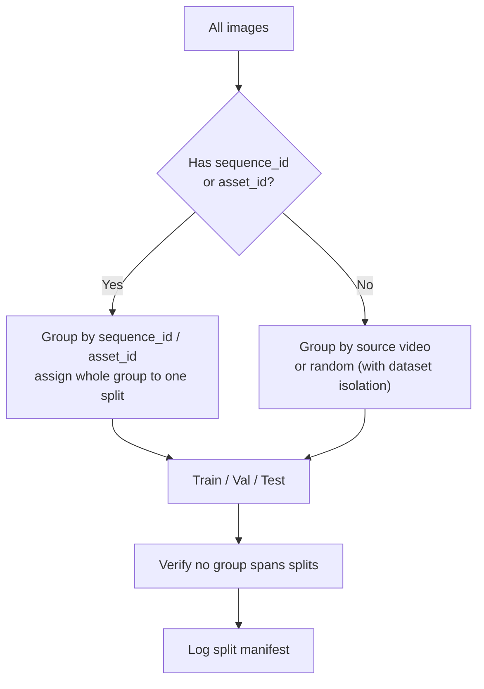

# Unified Data Schema — Phase 2 Normalization

> Goal: combine heterogeneous sources **without pretending their annotations are identical**. Unknown fields remain `null` with provenance.

## 1. Schema Definition

| Field | Type | Required | Description |
|---|---|---|---|
| `image_id` | string | yes | Unique image identifier (dataset-scoped) |
| `dataset_id` | enum | yes | `railsense` / `surface_faults` / `rfdd` / `rail5k` / `raildb` / `subgrade` / `custom_temporal` |
| `component_type` | enum | yes | `rail` / `fastener` / `sleeper` / `fishplate` / `unknown` |
| `defect_type` | string \| null | no | Constrained to taxonomy of `dataset_id`; `null` = normal/unknown |
| `bbox` | `[x,y,w,h]` \| null | no | Normalized or pixel coords; `null` if not annotated |
| `mask_path` | string \| null | no | Path to pixel mask (RFDD); else null |
| `polyline` | json \| null | no | For Rail-DB rail geometry |
| `source` | string | yes | Original file path + dataset version |
| `sequence_id` | string \| null | no | Video/sequence grouping for leakage prevention |
| `inspection_id` | string \| null | no | Inspection run identifier (temporal) |
| `asset_id` | string \| null | no | Persistent component ID (only custom longitudinal) |
| `timestamp` | datetime \| null | no | Capture time (temporal) |
| `latitude` | float \| null | no | GPS lat |
| `longitude` | float \| null | no | GPS lon |
| `chainage_m` | float \| null | no | Linear chainage along track |
| `track_id` | string \| null | no | `UP` / `DOWN` etc. |
| `line_id` | string \| null | no | Line identifier |
| `anomaly_score` | float \| null | no | Output, not input |
| `severity` | float \| null | no | Output |
| `split` | enum | yes | `train` / `val` / `test` (grouped assignment) |

## 2. Example Records

```json
{
  "image_id": "rfdd_000821",
  "dataset_id": "rfdd",
  "component_type": "fastener",
  "defect_type": "displaced",
  "bbox": [1012, 884, 64, 48],
  "mask_path": "datasets/rfdd/masks/000821.png",
  "sequence_id": null,
  "asset_id": null,
  "timestamp": null,
  "latitude": null,
  "longitude": null,
  "chainage_m": null,
  "split": "train"
}
```

```json
{
  "image_id": "railsense_fastener_0421",
  "dataset_id": "railsense",
  "component_type": "fastener",
  "defect_type": null,
  "bbox": null,
  "sequence_id": null,
  "asset_id": null,
  "split": "train"
}
```

```json
{
  "image_id": "custom_FASTENER-00182_2026-09-10",
  "dataset_id": "custom_temporal",
  "component_type": "fastener",
  "defect_type": "displaced",
  "bbox": [512, 340, 58, 44],
  "asset_id": "FASTENER-00182",
  "inspection_id": "INSP-2026-09-10-LINE01",
  "timestamp": "2026-09-10T08:30:00Z",
  "latitude": 12.123456,
  "longitude": 77.123456,
  "chainage_m": 124320,
  "track_id": "UP",
  "line_id": "LINE-01",
  "split": "test"
}
```

## 3. Splitting Rules (Leakage Prevention)



- Never `frame1→train, frame2→test` from same video.
- Never split same `asset_id` across train/test when temporal data exists.
- Cross-dataset eval: `train on A, test on B` is a separate experiment, not a split.

## 4. Null Semantics

- `null` = not available in source, not zero, not normal.
- Downstream code must handle `null` explicitly (e.g., temporal engine skips records with `asset_id == null`).

## 5. Storage

- Normalized manifest: `datasets/manifest.jsonl` (one JSON per line, per schema above).
- Raw datasets remain untouched under `datasets/{railsense,rfdd,...}/`.
- Conversion scripts: `ml/dataset_tools/convert_*.py` (to be implemented in Phase 2).
