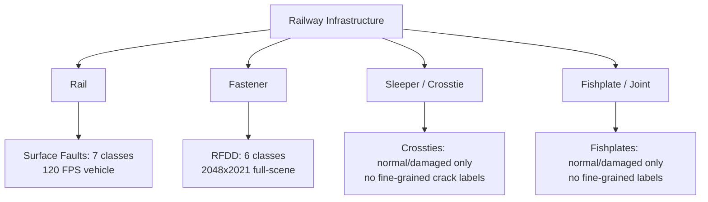
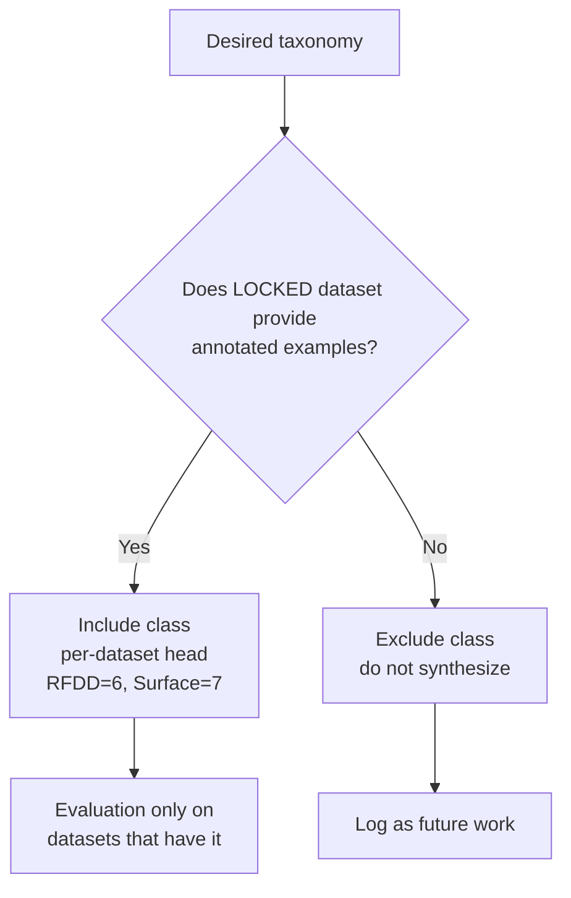

# Defect Taxonomy — Constrained to Available Data (Verified 2026-09-15)

> Rule: **Do not create labels for defect types without examples.** Taxonomy is the intersection of literature + actual annotated instances. All names locked to source datasets as verified.

## 1. Core Components (Locked v1 Scope)



Aligns with systematic review concentration on track/rail/fastening.

## 2. Fasteners — RFDD Taxonomy (Locked to RFDD Source)

Verified from GH README + scidb.cn description (strictly defined by engineering specs / maintenance tolerances, 6 consistency principles):

| Canonical (RFDD GH) | Synonym (ScienceDB/earlier docs) | Availability | Notes |
|---|---|---|---|
| `Normal` | `intact` | RFDD ✅ 1350 imgs, >8100 instances, masks+boxes | Baseline class |
| `Missing` | `missing` | RFDD ✅ | — |
| `Reversed` | `Inverted` | RFDD ✅ | GH says Reversed, ScienceDB says Inverted — **lock to Reversed/Inverted alias** |
| `Displaced` | `displaced` | RFDD ✅ | — |
| `Deformed` | `deformed` | RFDD ✅ | — |
| `Broken` | `Fractured` | RFDD ✅ | GH says Broken, ScienceDB says Fractured — **lock to Broken/Fractured alias** |

> **Lock:** Use GH canonical names as primary labels, accept ScienceDB aliases in mapping table. Do not add `corroded`, `loose`, `foreign-object` etc. — those belong to other datasets (e.g., RFD Roboflow dataset with e-type/w-type) not RFDD.

## 3. Rail Surface — Track Surface Faults Taxonomy (Locked to Mendeley)

Mendeley Data page + Data in Brief verified 7 classes (order as listed on page):

| Class | Provenance | Available |
|---|---|---|
| `Grooves` | Mendeley 10.17632/8hxtgyyxrw.2 | ✅ |
| `Joints` | Mendeley | ✅ |
| `Cracks` | Mendeley | ✅ |
| `Flakings` | Mendeley | ✅ |
| `Shellings` | Mendeley | ✅ |
| `Spallings` | Mendeley | ✅ |
| `Squats` | Mendeley | ✅ |

Only these 7 are valid for supervised rail-surface head. Rail-5k's 13 types (crack, spalling, corrugation, contact band…) overlap partially but are **different dataset** — do not merge taxonomies.

## 4. Sleeper / Crosstie (Locked)

RailSense provides `crossties` folder with `normal/` + `damaged/` only — **no fine-grained labels** (no cracked/damaged/broken split). Therefore:

```text
crosstie_normal
crosstie_damaged   # anomaly only, not supervised defect type
```

If finer sleeper defects needed, they must be sourced from a dataset that provides them — none of our locked datasets do.

## 5. Fishplate / Rail Joint (Locked)

RailSense `fishplates/` + `tracks/` similarly `normal/` + `damaged/` only. No `cracked/displaced/missing` fine labels. Therefore:

```text
fishplate_normal
fishplate_damaged
```

Supervised fishplate defect classification is **out of scope for v1** unless a new dataset is added.

## 6. Rail-5k Overlap (Informational, Not Primary)

Rail-5k annotates 13 types including `rail surface, wheel-rail contact band, crack, spalling, corrugation, fastening, screw` — verified from Zenodo + arXiv. These are **not** to be used as v1 supervised classes due to restricted access. Document here for future external validation only.

## 7. Rail-DB (Not Defect Taxonomy)

Rail-DB provides **9 scene categories** (lighting/structure/view) + rail polylines, not defect classes. Use for geometry, not defect labels.

## 8. Cross-Dataset Rules (Locked)



- **Per-dataset heads:** `head_rfdd` (6 classes) and `head_surface` (7 classes) — no universal head forcing 13 classes.
- **Component-specific anomaly:** Separate `anomaly_fastener`, `anomaly_rail`, `anomaly_crosstie`, `anomaly_fishplate` (H2).

## 9. Locked Unified Label

```json
{
  "component_type": "fastener",
  "defect_type": "Displaced",
  "defect_alias": "displaced",
  "source_dataset": "RFDD",
  "source_doi": "10.57760/sciencedb.msdc.00071",
  "confidence": 0.93,
  "bbox": [x, y, w, h],
  "mask_available": true
}
```

`defect_type == null` + high `anomaly_score` → `UNKNOWN_ABNORMALITY` (hybrid).
