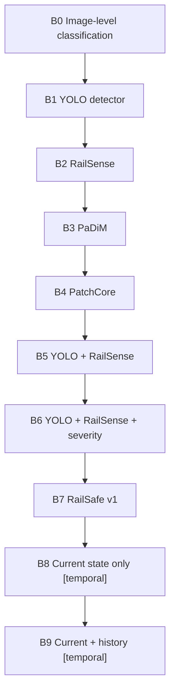
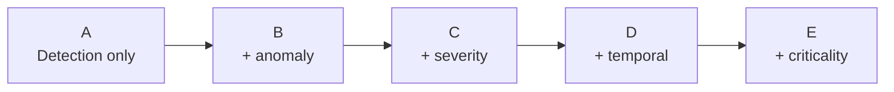

# Baselines & Ablations

## 1. Baseline Hierarchy

| Baseline | Description | Comparison For |
|---|---|---|
| B0 | Image-level classifier (no localization) | Shows value of detection |
| B1 | YOLO alone | Exp 3, 4 |
| B2 | RailSense alone | Exp 1, 2 |
| B3 | PaDiM | Exp 2 |
| B4 | PatchCore | Exp 2 |
| B5 | YOLO + RailSense | Exp 4, H1 |
| B6 | + severity | Exp 6 |
| B7 | RailSafe v1 (full without temporal) | Ablation E before temporal |
| B8 | Current-state-only ranking | Exp 9 baseline for temporal |
| B9 | Current+history ranking | Exp 9 temporal claim (H3) — gated |

## 2. Ablation A-E

| Config | Modules | Evaluates |
|---|---|---|
| A | Detection only | Can we find components? |
| B | A + anomaly | Does normality add coverage? (H1) |
| C | B + severity | Does severity improve prioritization? |
| D | C + temporal | Does deterioration improve? (H3, gated) |
| E | D + criticality | Does engineering prior help? |

Report Δ for each addition on `mAP, AUROC, severity, Precision@K`.

## 3. Execution Notes

- Fix splits and seeds across baselines.
- Tune thresholds per baseline on `val`, evaluate on `test`.
- Log everything to W&B with `baseline` tag.
