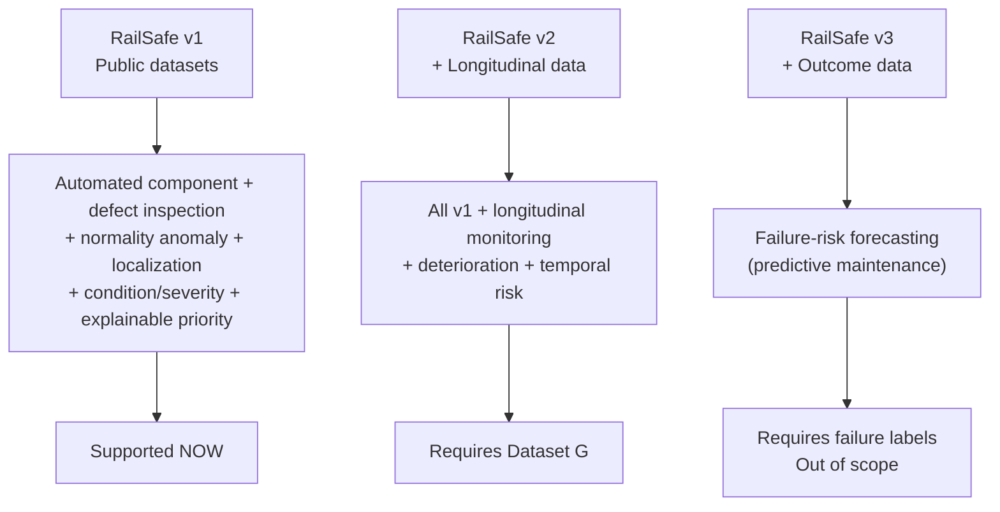
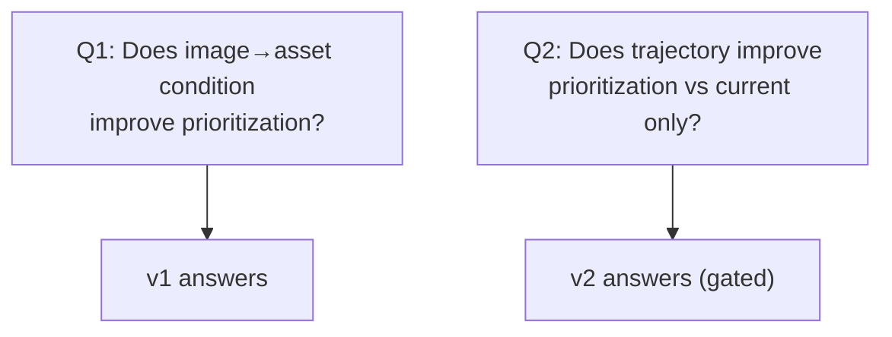

# Claims Scope — v1 / v2 / v3

## 1. What We Claim at Each Stage

| Stage | Exact Claim | Supported By | Do NOT Claim |
|---|---|---|---|
| **v1** | Visual condition monitoring + maintenance prioritization via hybrid detection, severity, risk | RailSense, RFDD, Surface Faults, Rail-DB | Temporal deterioration, predictive maintenance |
| **v2** | + deterioration trajectory improves prioritization vs current-state only (RQ5/H3) | + Dataset G (repeated observations) | General failure forecasting without outcome data |
| **v3** | Failure-risk forecasting | Inspection→maintenance→failure outcomes | Do not claim with v1 data |

## 2. Wording Rules

- v1 risk thresholds = **RailSafe decision-support thresholds**, not railway safety limits.
- Heatmap = **anomaly localization map** until validated vs masks.
- Severity/risk weights = **prototype/experimental**, not official criticality.

## 3. Defining Sentence (Use in Report)

> *RailSafe is a railway infrastructure visual condition-monitoring and maintenance-prioritization framework that combines full-scene component detection, supervised defect recognition and normality-based anomaly detection to generate component-level condition assessments. Each observation is associated with spatial asset metadata and stored as part of an asset history. When repeated inspections of the same physical asset are available, RailSafe additionally estimates condition deterioration and incorporates the trend into an explainable risk-based maintenance priority.*

## 4. Research Identity

Do not call v1 "predictive" because it produces a risk score. Predictive requires validated temporal outcome data per recent literature distinctions.

## 5. Checklist Before Claiming v2

- [ ] Dataset G collected with `asset_id + timestamp + location + condition`
- [ ] Association eval shows linking is reliable (Exp 7)
- [ ] Deterioration evaluated vs current-only (Exp 8/9)
- [ ] Results reported with caveats about rig vs field provenance
