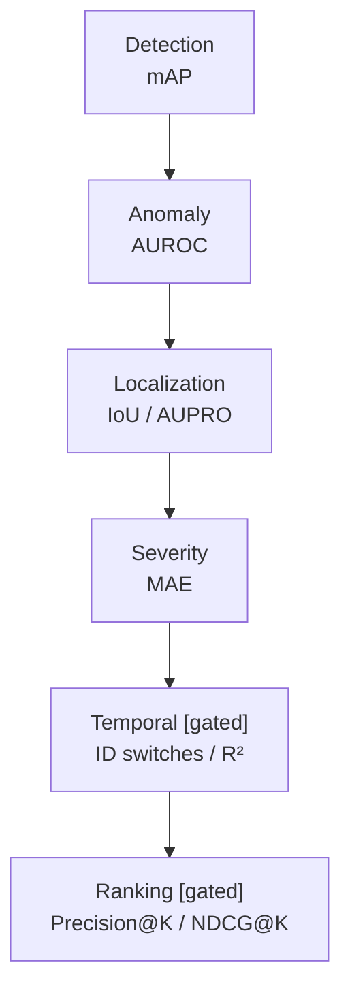

# Evaluation Metrics

## 1. Per-Module Metrics

| Module | Primary Metrics | Notes |
|---|---|---|
| Component detection | `mAP@50, mAP@50:95, Precision, Recall, F1` | Per class; grouped splits |
| Defect detection | `mAP, F1, Recall` | Per defect type |
| Anomaly detection | `AUROC, AUPRC, F1` | Threshold from val; per component type |
| Localization | `IoU, pixel AUROC, AUPRO` | Requires RFDD masks; heatmap = anomaly map |
| Severity | `MAE, RMSE, weighted F1` | Against severity labels |
| Association [gated] | `Precision, Recall, F1, ID switches` | Tracking-style |
| Deterioration [gated] | `MAE, RMSE, R², Spearman` | Trend fit quality |
| Maintenance ranking [gated] | `Precision@K, Recall@K, NDCG@K` | Top-K queue relevance |



## 2. Ranking Metrics Detail

Given `K` inspection slots:

- `Precision@K = (# true high/critical in top-K) / K`
- `Recall@K = (# true high/critical in top-K) / (# true high/critical)`
- `NDCG@K` rewards putting most critical earlier in queue.

Run for `K = 10, 20, 50` (or per capacity scenario).

## 3. Cross-Dataset Robustness (RQ6/H4)

```text
Train on A → Test on B
```

Compare `within-dataset` vs `cross-dataset` AUROC/mAP. Expected drop; report magnitude.

Vary: camera, lighting, weather, track type, country, resolution, motion blur (where metadata allows).

## 4. Reporting

- Every table must state split strategy (grouped vs random), dataset version, seed, and threshold selection method.
- Confidence intervals via bootstrap where feasible.
