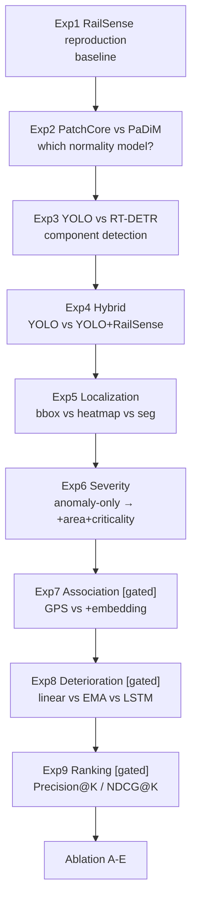
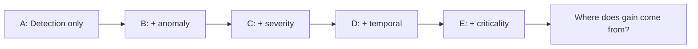

# Experiment Design (9 Experiments + Ablation)

> We want a proper experimental story, not "93% accuracy".



## Exp 1 — RailSense Reproduction

- Run original without modification (`python main.py both`), W&B logging.
- Goal: reproducible anomaly baseline.
- Metrics: `AUROC, AUPRC, Precision, Recall, F1`.

## Exp 2 — PatchCore vs PaDiM vs RailSense AE

- Question: which normality-learning strategy is most effective for railway component anomalies?
- Per component type; component-specific vs generic (H2).

## Exp 3 — Full-Scene Component Detection

- Compare `YOLO` vs `RT-DETR` on RFDD / Surface Faults.
- Metrics: `mAP@50, mAP@50:95, Precision, Recall, F1`.
- Cross-dataset `train A test B` for RQ6/H4.

## Exp 4 — Hybrid Detection

- Compare `YOLO` vs `YOLO+RailSense`.
- Question: does anomaly identify abnormalities missed by predefined classes? (H1)
- Metrics: abnormality recall / F1.

## Exp 5 — Localization

- Compare `bbox` vs `heatmap` vs `segmentation`.
- Where RFDD masks exist: `IoU, pixel AUROC, AUPRO`.

## Exp 6 — Severity

- Compare `anomaly-only` vs `+defect type` vs `+area+criticality`.
- Metrics: `MAE, RMSE, weighted F1` vs severity labels.

## Exp 7 — Temporal Association [Gated]

- Compare `GPS only` vs `GPS+embedding` vs `GPS+embedding+geometry`.
- Metrics: `Precision, Recall, F1, ID switches`.

## Exp 8 — Temporal Deterioration [Gated]

- Compare `current only` vs `current+history`
- Then `linear` vs `EMA` vs `LSTM/Transformer` (only if n sufficient).
- Metrics: `MAE, RMSE, R², Spearman`.

## Exp 9 — Maintenance Prioritization [Gated — Most Important]

Given top-K inspection budget:

```
Precision@K, Recall@K, NDCG@K
```

Example: top-20 priorities — how many are truly high/critical per ground truth/expert labels? More meaningful than generic accuracy.

Compare `R_current` vs `R_current+deterioration` (H3).

## Ablation Study



- A-E evaluated on same splits; report table with `mAP, AUROC, severity, Precision@K`.

## Execution Order

Do not skip: **1→2→3→4→5→6** before any gated experiment. Each builds on the previous artifact.
