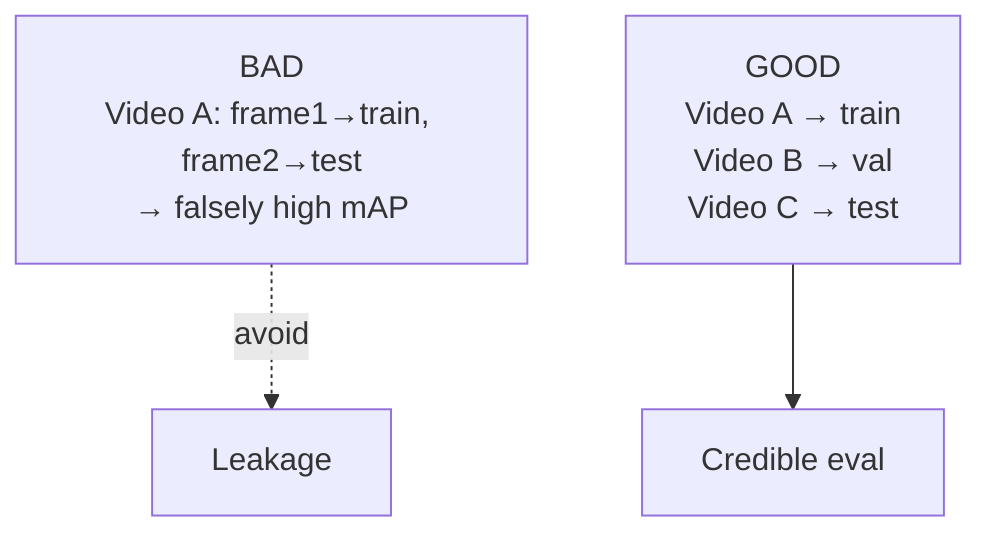
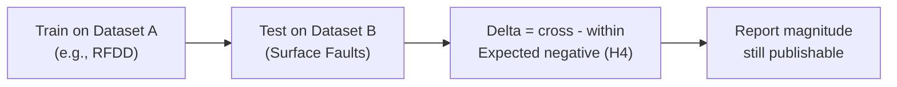

# Data Leakage Prevention & Generalization

## 1. Leakage Risk

Railway datasets derived from video have near-identical adjacent frames. Random splits inflate scores.



## 2. Rules

- **Group by `sequence_id`/`video`/`asset_id`** — entire group goes to one split.
- If no sequence field, group by source file prefix or manual video grouping.
- **Asset groups** for temporal: same `asset_id` never spans train/test.
- Document split manifest; verify no group ID appears in >1 split.

```python
# pseudocode
groups = df.groupby("sequence_id")  # or asset_id
train_groups, test_groups = split(groups)  # group-level

assert not set(train_groups.ids) & set(test_groups.ids)
```

## 3. Generalization (RQ6/H4)

Railway performance is domain-sensitive:

```text
camera, lighting, weather, track type, country, rail geometry,
camera height, resolution, speed, motion blur
```



Plan at least one cross-dataset pair: `RFDD ↔ Surface Faults`, and `RailSense ↔ RFDD` for anomaly.

## 4. Robustness Splits (Optional)

Where metadata allows, evaluate slices:

- Day vs night, dry vs wet, high vs low camera angle.
- Plot `AUROC / mAP` per slice.

## 5. Checklist

- [ ] `sequence_id` / `asset_id` grouping implemented
- [ ] Cross-dataset eval run
- [ ] Split manifest committed to `experiments/results/splits/`
- [ ] Leakage ablation: compare random-frame vs grouped split (show inflation)
