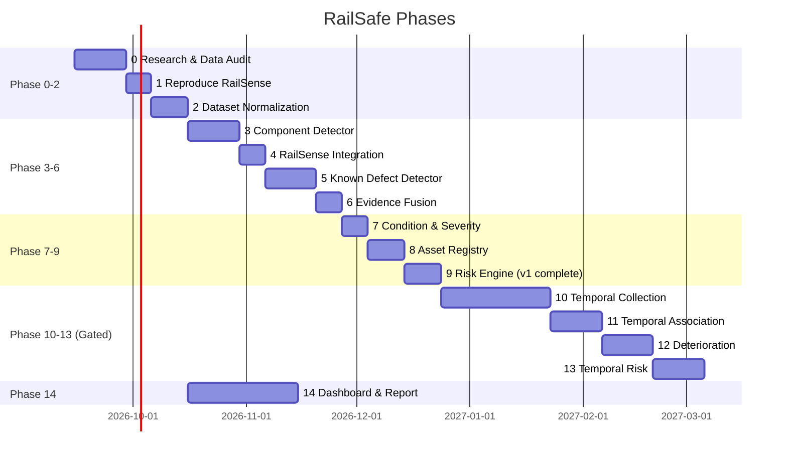

# Development Phases (14 Phases)



| Phase | Name | Deliverable | Gated? |
|---|---|---|---|
| 0 | Research/Data Audit | `datasets.md`, `taxonomy.md`, `research_questions.md`, `data_license.md`, inventory | No |
| 1 | Reproduce RailSense | `python main.py both` baseline + W&B report | No |
| 2 | Dataset Normalization | Unified schema + `manifest.jsonl` + grouped splits | No |
| 3 | Component Detector | YOLO training + `mAP` vs RT-DETR (Exp 3) | No |
| 4 | RailSense Integration | `Full frame → detector → crop → RailSense → heatmap` pipeline | No |
| 5 | Known Defect Detector | Per-dataset heads (RFDD, Surface) | No |
| 6 | Evidence Fusion | Hybrid record + Exp 4 | No |
| 7 | Condition & Severity | `severity_engine.py` + Exp 6 | No |
| 8 | Asset Registry | PostGIS schema + `component_id` + GPS/chainage | No |
| 9 | Risk Engine | `risk_engine.py` + explainability + **v1 complete** | No |
| 10 | Temporal Collection | Dataset G (`asset_id + timestamp + location`) | **Yes** |
| 11 | Temporal Association | `association.py` + Exp 7 | **Yes** |
| 12 | Deterioration | `deterioration.py` linear/EMA before LSTM | **Yes** |
| 13 | Temporal Risk | `R_current` vs `R_current+deterioration` + Exp 9 | **Yes** |
| 14 | Dashboard | Map + Detail + Queue + report/presentation (parallel from Phase 2) | No |

## Recommended Order

```text
1→2→3→4→5→6→7→8→9  (v1 sequential, do not skip)
10 in parallel with 3-9 where possible (partner outreach)
11→12→13 after 10
14 continuous
```

- Do not start with LSTM (Phase 12): linear first.
- Dashboard (Phase 14) can start wireframes early, full data binding after Phase 9.
