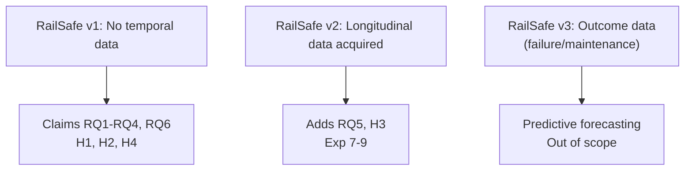

# Research Questions & Hypotheses

## 1. Research Questions

| # | Question | Gated? |
|---|---|---|
| **RQ1** | How accurately can RailSafe detect and localize railway component defects? | No |
| **RQ2** | Can normality-based anomaly detection identify visual abnormalities outside predefined defect classes? | No |
| **RQ3** | Does combining supervised defect detection with anomaly detection improve abnormality identification vs either alone? | No |
| **RQ4** | Can visual evidence, affected area, and component criticality be combined into an explainable condition/severity representation? | No |
| **RQ5** | When repeated observations of the same physical component are available, can temporal condition information improve maintenance prioritization? | **Yes — requires Dataset G** |
| **RQ6** | How robust is the system when transferred across railway datasets captured in different environments/conditions? | No |

## 2. Hypotheses

| # | Hypothesis | Test |
|---|---|---|
| **H1** | Hybrid supervised + anomaly will identify broader abnormalities than supervised alone. | Exp 4: YOLO vs YOLO+RailSense (recall/F1) |
| **H2** | Component-specific anomaly models will outperform a single generic model. | Exp 2 per-type vs generic AUROC |
| **H3** | Adding temporal condition information will improve top-K prioritization vs current-state-only ranking. | Exp 8-9: `R_current` vs `R_current+deterioration` (Precision@K, NDCG@K) — **gated** |
| **H4** | Cross-dataset performance will be lower than within-dataset due to domain shift. | Exp cross-dataset mAP/AUROC drop; negative result is scientifically valuable |

## 3. Claim Boundaries

Do not claim RQ5/H3 in v1.

## 4. Mapping to Experiments

- RQ1 → Exp 1, 3, 5
- RQ2 → Exp 1, 2
- RQ3 → Exp 4 (primary), ablation B
- RQ4 → Exp 6
- RQ5 → Exp 7, 8, 9 (gated)
- RQ6 → Exp 3 cross-dataset + Exp 2 cross-dataset
